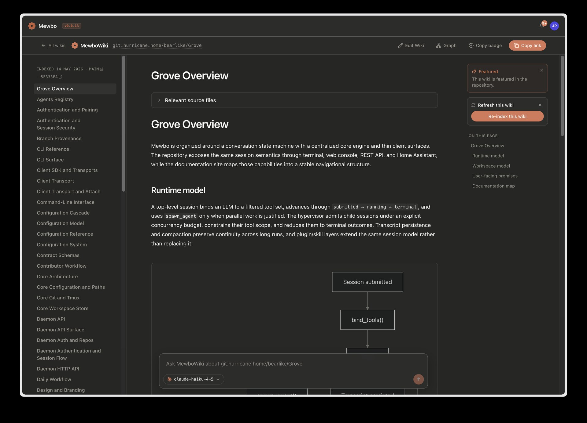
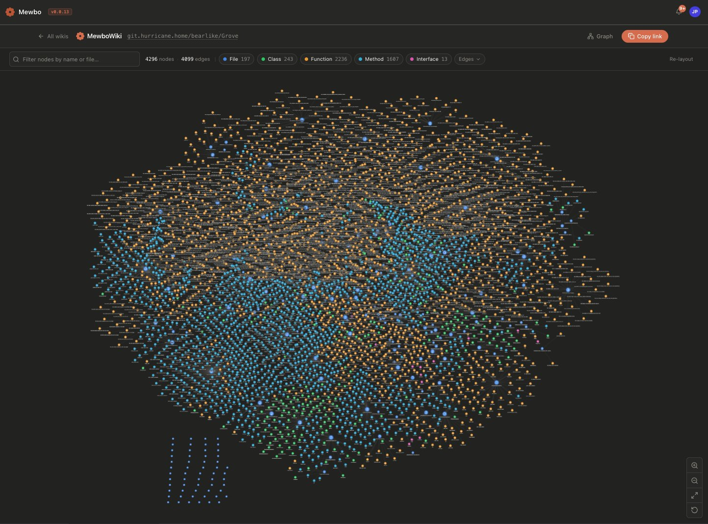
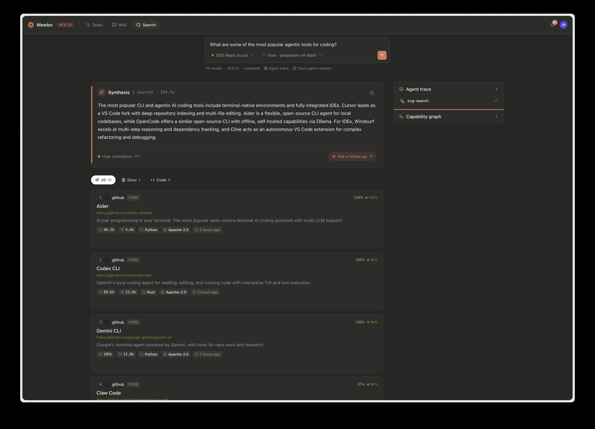
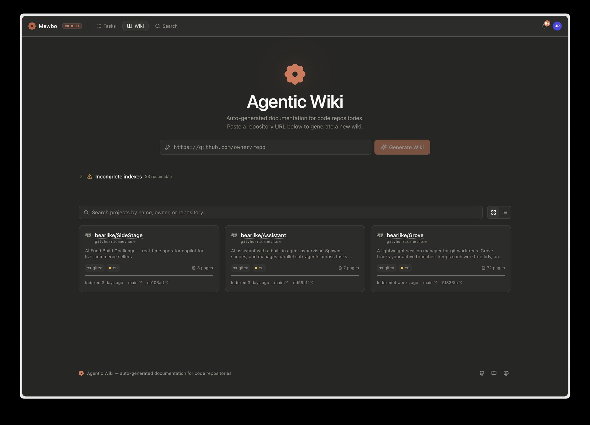
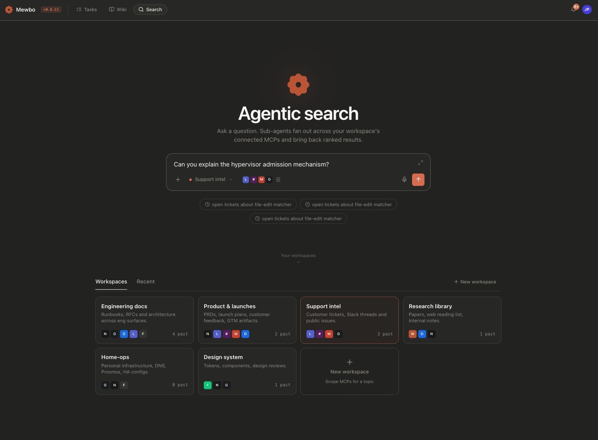

  

<h1 align="center">Mewbo</h1>

<strong>An open stack for agentic work, grounded in your own knowledge.</strong>

    
    
    
    
    
    
    

<em>Agentic task automation, memory-graph documentation and Q&amp;A, and search across every tool you connect. Any model, open source.</em>

https://github.com/user-attachments/assets/78754e8f-828a-4c54-9e97-29cbeacbc3bc

<table align="center">
    <tr>
        <td align="center"></td>
        <td align="center"></td>
    </tr>
    <tr>
        <td align="center"></td>
        <td align="center"></td>
    </tr>
</table>

<b>More screenshots</b>: console, wiki, search, and integrations

 

<table align="center">
    <tr><td colspan="2" align="center"><b>A SESSION, END TO END</b></td></tr>
    <tr>
        <td align="center" width="50%"> Your sessions at a glance</td>
        <td align="center" width="50%"> Inside a task, step by step</td>
    </tr>
    <tr>
        <td align="center" width="50%"> Plan mode: approve before anything runs</td>
        <td align="center" width="50%"> Every edit lands as a reviewable diff</td>
    </tr>
    <tr><td colspan="2" align="center"><b>THE KNOWLEDGE PRODUCTS</b></td></tr>
    <tr>
        <td align="center" width="50%"> Agentic Wiki: documentation from a repo URL</td>
        <td align="center" width="50%"> Agentic Search: workspaces over your connected tools</td>
    </tr>
    <tr><td colspan="2" align="center"><b>EXTEND IT, ON EVERY SURFACE</b></td></tr>
    <tr>
        <td align="center" width="50%"> Plugins and a marketplace to extend any session</td>
        <td align="center" width="50%"> The same agent, controlling Home Assistant</td>
    </tr>
    <tr>
        <td colspan="2" align="center"> Or working from your inbox over email</td>
    </tr>
</table>

## Overview

Mewbo is an open, model-agnostic stack for agentic work. At its core, a hypervisor decomposes a goal into parallel sub-agents that each carry only the tools they need and exchange compressed summaries instead of raw transcripts, within resource budgets you tune per deployment. Three products build on that core. The first automates multi-step tasks across your codebase and tools, isolating each change in its own Git worktree. The second generates living documentation and question answering, grounded in a multiplexed memory graph that runs alongside an AST index of your code. The third is a search engine rebuilt around agents and indexes, ranking results across every source you have connected. You approve destructive actions, watch the agent tree as it grows, and can steer any branch mid-flight. Sessions persist with full provenance, compact automatically near the budget, and run on any model across every client.

## Features

- **Agent hypervisor.** Sub-agents spawn in parallel with scoped tools and approval-gated actions. Progress shows as a live tree, and you can steer or cancel any branch mid-flight. The hypervisor enforces resource budgets through natural-language warnings rather than force-kills, and resolves every child into a structured result.
- **Long-horizon context.** Two-mode compaction summarises older turns near the budget. Post-compact file restoration replays the working set. Conversation fork lets you branch from any message and replay against a different model.
- **Native skills, plugins, and MCP.** Agent Skills, plugins from any compatible marketplace, and MCP servers load from user or project scope without translation. Plugins also contribute per-session stateful tools, hooks, and agent definitions.
- **Agentic Wiki.** Turns any repository into living documentation you can interrogate. Indexing pairs a multiplexed memory graph with an AST index of the code, so question answering traverses structure and meaning across many hops for authoritative answers grounded in the source itself.
- **Agentic Search.** A search engine rebuilt around agents and indexes. One query fans out across every source you've connected, from repos to trackers to chat, and comes back as one ranked list of results spanning them all, topped by a synthesised overview cited to its sources.
- **Inline interactive widgets.** Sub-agents author Streamlit-in-WASM widgets that mount in a sandboxed Web Worker inside the conversation, with no server round-trip and no CORS.
- **Provider-agnostic, multi-surface.** Any model behind LiteLLM, accessed from a terminal CLI, web console, REST API, Home Assistant, Nextcloud Talk, or email. Same session, same tools, same transcript.

## Get started

See [docs.mewbo.com/latest/getting-started](https://docs.mewbo.com/latest/getting-started/) to install Mewbo and run a first session.

## Documentation

Full documentation lives at **[docs.mewbo.com](https://docs.mewbo.com/latest/)**.

| Section | Covers |
| --- | --- |
| [Get Started](https://docs.mewbo.com/latest/getting-started/) | Install, configure an LLM, run a first session. |
| [Configure](https://docs.mewbo.com/latest/configuration/) | LLM setup, project config, configuration reference. |
| [Clients](https://docs.mewbo.com/latest/clients-cli/) | CLI, web console, REST API, Home Assistant, Nextcloud Talk, email. |
| [Knowledge & Discovery](https://docs.mewbo.com/latest/features-wiki/) | Agentic Wiki and Agentic Search, the source-grounded docs and cross-tool search products. |
| [Capabilities](https://docs.mewbo.com/latest/features-builtin-tools/) | Built-in tools, sub-agents, skills, plugins, widgets, plan mode, permissions, compaction. |
| [Deploy](https://docs.mewbo.com/latest/deployment-docker/) | Docker Compose, storage backends, production setup. |
| [Develop](https://docs.mewbo.com/latest/core-orchestration/) | Architecture, session runtime, building a client, API reference. |
| [Releases](https://github.com/bearlike/Assistant/releases) | Release notes and upgrade history. |

## Contributing

Bugs and feature requests on the [issue tracker](https://github.com/bearlike/Assistant/issues). For development setup, see the [developer guide](https://docs.mewbo.com/latest/developer-guide/).

## License

[MIT](LICENSE) © Krishnakanth Alagiri.
