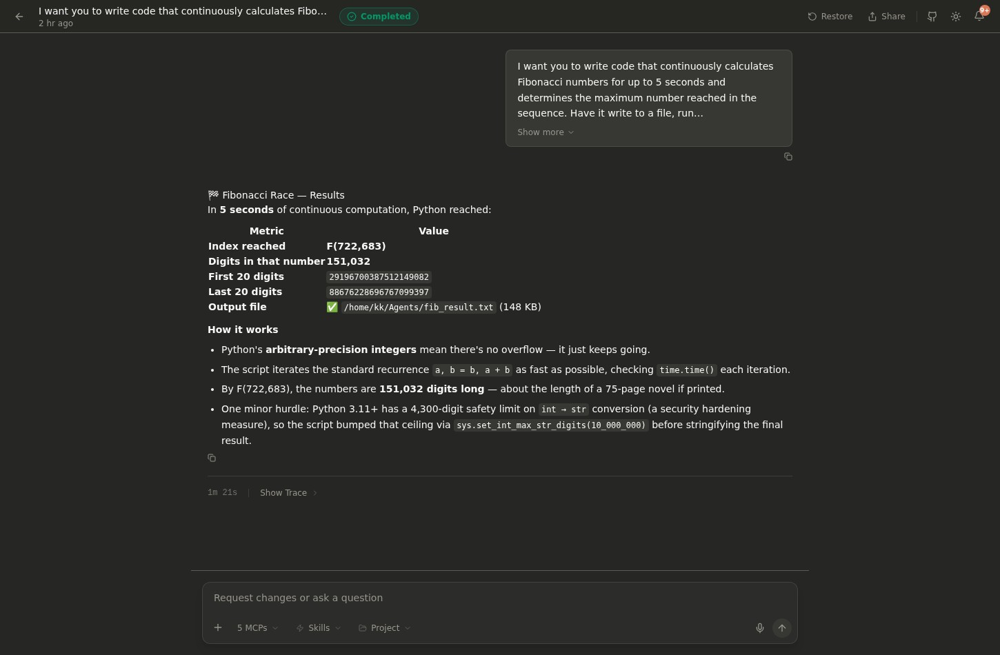
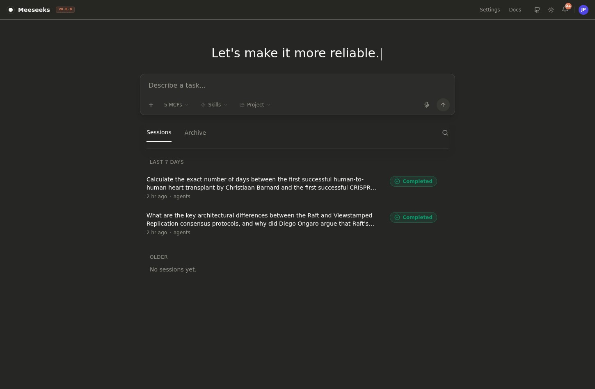
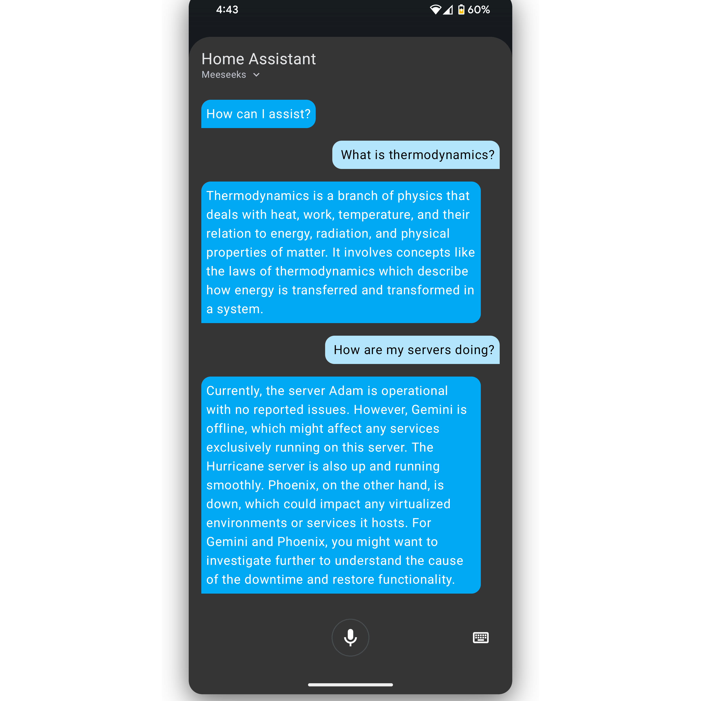
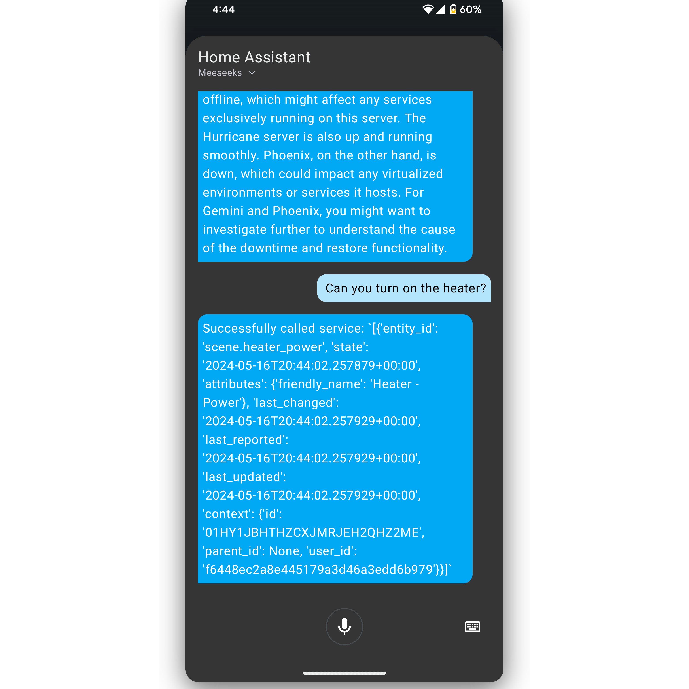

<h1 align="center">Meeseeks: The Personal Assistant 👋</h1>

<p align="center">
    <a href="https://deepwiki.com/bearlike/Assistant"></a>
    <a href="https://github.com/bearlike/Assistant/actions/workflows/docker-buildx.yml"></a>
    <a href="https://github.com/bearlike/Assistant/actions/workflows/lint.yml"></a>
    <a href="https://github.com/bearlike/Assistant/actions/workflows/docs.yml"></a>
    <a href="https://codecov.io/gh/bearlike/Assistant"></a>
    <a href="https://github.com/bearlike/Assistant/releases"></a>
    <a href="https://github.com/bearlike/Assistant/pkgs/container/meeseeks-api"></a>
</p>


https://github.com/user-attachments/assets/78754e8f-828a-4c54-9e97-29cbeacbc3bc
> Meeseeks runs right in your terminal, browser, or hosted as an API.

## Overview

Meeseeks is an AI task agent assistant built on a single async tool-use loop driven by native `bind_tools`. The LLM decides which tools to call, can spawn sub-agents for parallel work, and synthesizes a final reply. It keeps a session transcript, compacts long histories, and stores summaries for continuity across longer conversations.

### Meeseeks Console

The web console provides a task orchestration frontend backed by the REST API. It supports session management, real-time event polling, tool selection, and execution trace viewing.

<table align="center">
    <tr>
        <th>Task detail page</th>
        <th>Console landing page</th>
    </tr>
    <tr>
        <td align="center"></td>
        <td align="center"></td>
    </tr>
</table>

## Features

### Core workflow
- (✅) **Unified tool-use loop:** A single async `ToolUseLoop` where the LLM drives tool selection and execution via native `bind_tools`.
- (✅) **Sub-agent spawning:** Subtasks can be delegated to parallel sub-agents via `spawn_agent`, managed by the `AgentHypervisor` control plane.
- (✅) **Tool scoping & permissions:** Sub-agents receive scoped tool access (allowlist/denylist filtered before binding). Permission policies gate all tool execution.
- (✅) **Concurrency-aware execution:** Tools are partitioned into concurrent-safe (parallel) and exclusive (sequential) batches with per-tool timeouts.

### Memory and context management
- (✅) **Session transcripts:** Writes tool activity and responses to disk for continuity.
- (✅) **Context compaction:** Two-mode compaction (full/partial) with structured summaries, analysis scratchpad, and post-compact file restoration. Auto-compacts near the context budget using partial mode.
- (✅) **Token awareness:** Tracks context window usage and exposes budgets in the CLI.
- (✅) **Selective recall:** Builds context from recent turns plus a summary of prior events.
- (✅) **Hierarchical instructions:** Discovers CLAUDE.md from user, project, rules, and local levels with priority ordering. Injects git context (branch, status, recent commits) into the system prompt.
- (✅) **Session listing hygiene:** Filters empty sessions and supports archiving via the API.

### Tooling and integrations
- (✅) **Tool registry:** Discovers local tools and MCP tools via persistent connection pool with automatic reconnection and config change detection.
- (✅) **Skills:** Supports the [Agent Skills](https://agentskills.io) open standard. Place `SKILL.md` files in `~/.claude/skills/` or `.claude/skills/` to teach the assistant reusable workflows. Skills can be invoked via `/skill-name` slash commands or auto-activated by the LLM.
- (✅) **Local file + shell tools:** Built-in Aider adapters for edit blocks, read files, list dirs, and shell commands (approval-gated). Edit blocks require strict SEARCH/REPLACE format; the tool returns format guidance on mismatches.
- (✅) **REST API:** Exposes the assistant over HTTP for third-party integration.
- (✅) **Web console:** Task orchestration frontend backed by the REST API.
- (✅) **Terminal CLI:** Fast interactive shell with plan visibility and tool result cards.
- (✅) **Model routing:** Supports provider-qualified model names and a configurable API base URL.

### Safety and observability
- (✅) **Permission gate:** Uses approval callbacks and hooks to control tool execution.
- (✅) **Operational visibility:** Optional Langfuse tracing (session-scoped traces) stays off if unconfigured.
- (✅) **Hook system:** Error-isolated hooks with session lifecycle events, external command hook configuration, and fnmatch-based tool matcher filtering.

### Interface notes
- **CLI layout adapts to terminal width.** Headers and tool result cards adjust to small and wide shells.
- **Interactive CLI controls.** Use a model picker, MCP browser, session summary, and token budget commands.
- **Inline approvals.** Rich-based approval prompts render with padded, dotted borders and clear after input.
- **Unified experience.** Console, API, Home Assistant, and CLI interfaces share the same core engine to reduce duplicated maintenance.
- **Shared session runtime.** The API exposes polling endpoints; the CLI runs the same runtime in-process for sync execution, cancellation, and summaries.
- **Event payloads.** `action_plan` steps are `{title, description}`; `tool_result`/`permission` use `tool_id`, `operation`, and `tool_input`.

### Home Assistant integration

<table align="center">
    <tr>
        <th>Answer questions and interpret sensor information</th>
        <th>Control devices and entities</th>
    </tr>
    <tr>
        <td align="center"></td>
        <td align="center"></td>
    </tr>
</table>

## Installation

<p align="center">
    
</p>

User install (core only):
```bash
uv sync
```

Optional components:
```bash
uv sync --extra cli   # CLI
uv sync --extra api   # REST API
cd apps/meeseeks_console && npm install  # Web console
uv sync --extra ha    # Home Assistant integration
```

Developer install (all components + dev/test/docs):
```bash
uv sync --all-extras --all-groups
```

Global install (available system-wide as `meeseeks`):
```bash
uv tool install .
# Set up global config:
mkdir -p ~/.meeseeks
cp configs/app.json ~/.meeseeks/app.json
cp configs/mcp.json ~/.meeseeks/mcp.json
# Or run `meeseeks` and use /init to scaffold example configs
```

Config discovery priority: `CWD/configs/` → `$MEESEEKS_HOME/` → `~/.meeseeks/`. Use `--config /path/to/app.json` for explicit override, or set `MEESEEKS_HOME` in your shell profile (`~/.bashrc`, `~/.zshrc`, etc.) to permanently point to a custom config directory:
```bash
export MEESEEKS_HOME="/path/to/your/config"
```

### Docker Compose

Pre-built images are published to GHCR on every release:

```bash
# Copy and edit the environment file
cp docker.example.env docker.env
# Edit docker.env — set MASTER_API_TOKEN, VITE_API_KEY, HOST_UID/GID

# Pull and start (recommended)
docker compose pull && docker compose up -d
```

To build from source instead: `docker compose up --build -d`.

The stack uses host networking. The API serves on port `5125` and the console on `3001`. Nginx in the console container proxies `/api/` requests to the API. See [docs/getting-started.md](docs/getting-started.md) for full configuration details.

## Architecture

See [docs/index.md](docs/index.md) for the full architecture diagram.

## Monorepo layout

- `packages/meeseeks_core/`: orchestration loop, schemas, session storage, two-mode compaction, tool registry, hook system, hierarchical instruction discovery.
- `packages/meeseeks_tools/`: tool implementations and integrations (including Home Assistant and MCP).
- `apps/meeseeks_api/`: Flask REST API for programmatic access.
- `apps/meeseeks_console/`: Web console for task orchestration.
- `apps/meeseeks_cli/`: Terminal CLI frontend for interactive sessions.
- `meeseeks_ha_conversation/`: Home Assistant integration that routes voice to the API.
- `packages/meeseeks_core/src/meeseeks_core/prompts/`: planner prompts and tool instructions.

## Documentation

**Overview**
- [docs/index.md](docs/index.md) — product overview and architecture

**Setup and configuration**
- [docs/getting-started.md](docs/getting-started.md) — setup guide (env, MCP, configs, run paths)

**Repository map**
- [docs/components.md](docs/components.md) — monorepo map

**Reference**
- [docs/reference.md](docs/reference.md) — API reference (mkdocstrings)
- [docs/session-runtime.md](docs/session-runtime.md) — shared session runtime used by CLI + API

## Development principles

- Keep the core engine centralized. Interfaces should remain thin to avoid duplicated maintenance.
- Organize logic into clear modules, classes, and functions. Favor readable, well-scoped blocks.
- Prefer small, composable changes that keep behavior consistent across interfaces.

## Contributing

We welcome contributions from the community to improve Meeseeks.

1. Fork the repository and clone it to your local machine.
2. Create a new branch for your contribution.
3. Make your changes, commit them, and push to your fork.
4. Open a pull request describing the change and the problem it solves.

If you encounter bugs or have ideas for features, open an issue on the [issue tracker](https://github.com/bearlike/Assistant/issues). Include reproduction steps and error messages when possible.
