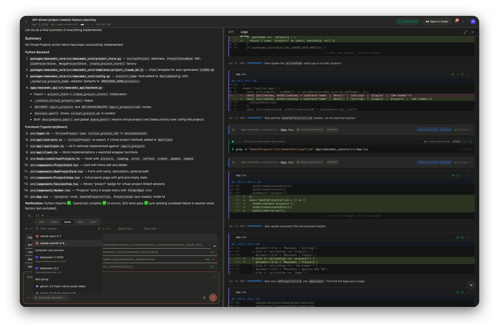
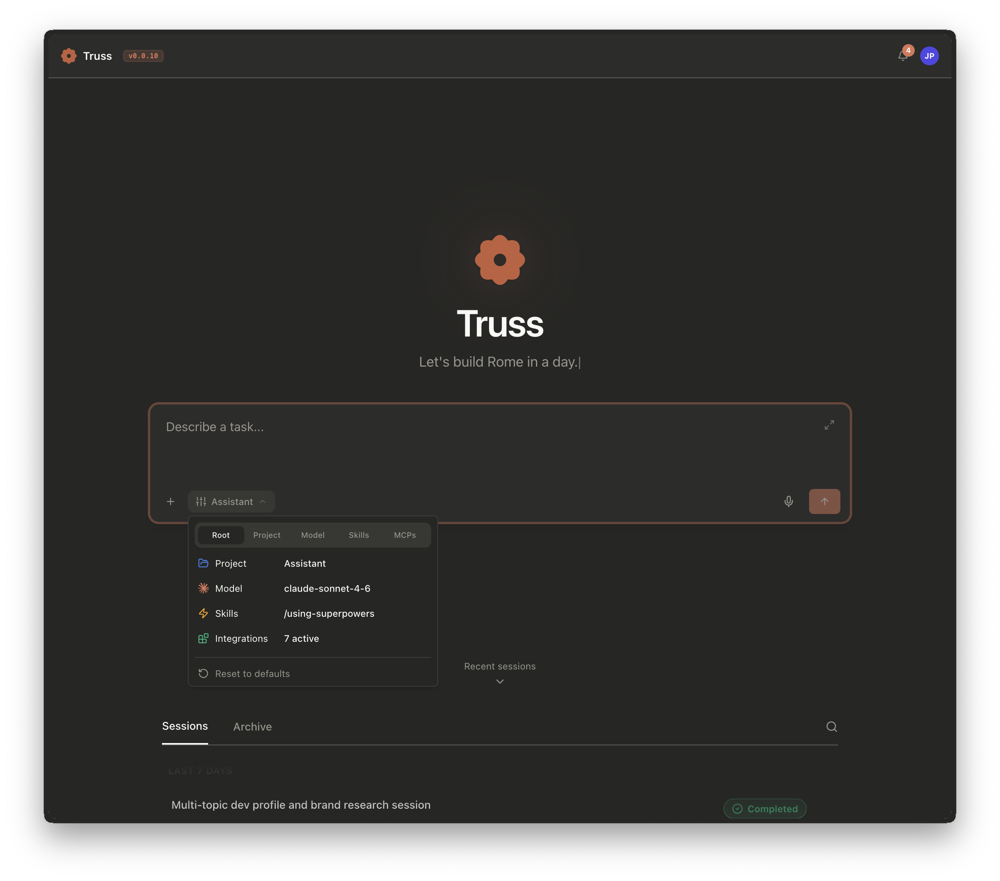
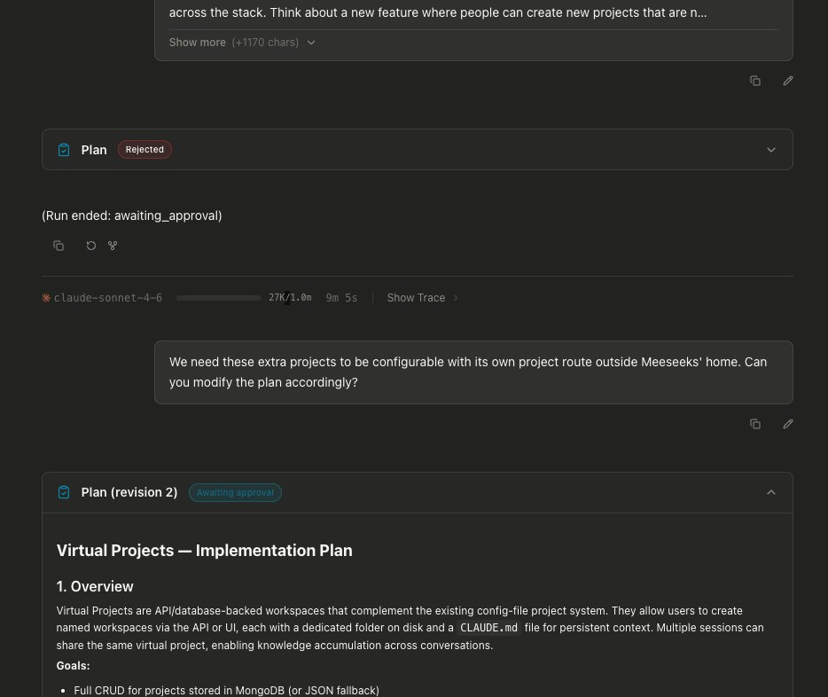
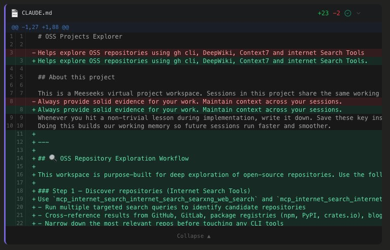
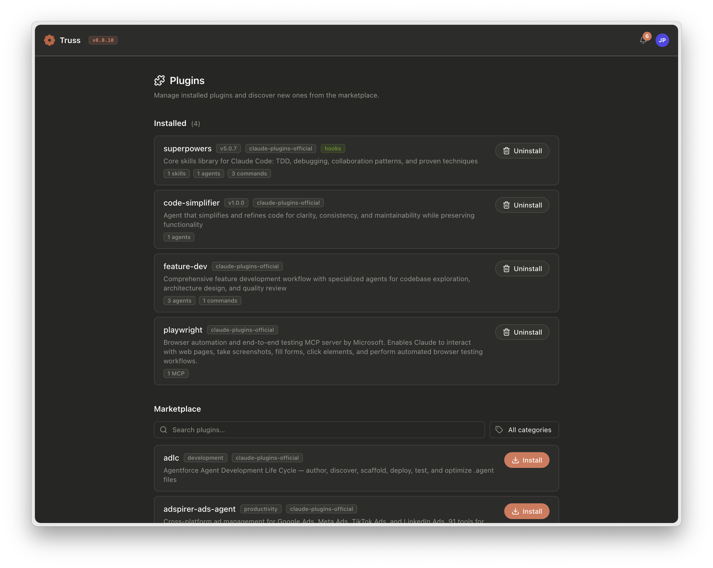
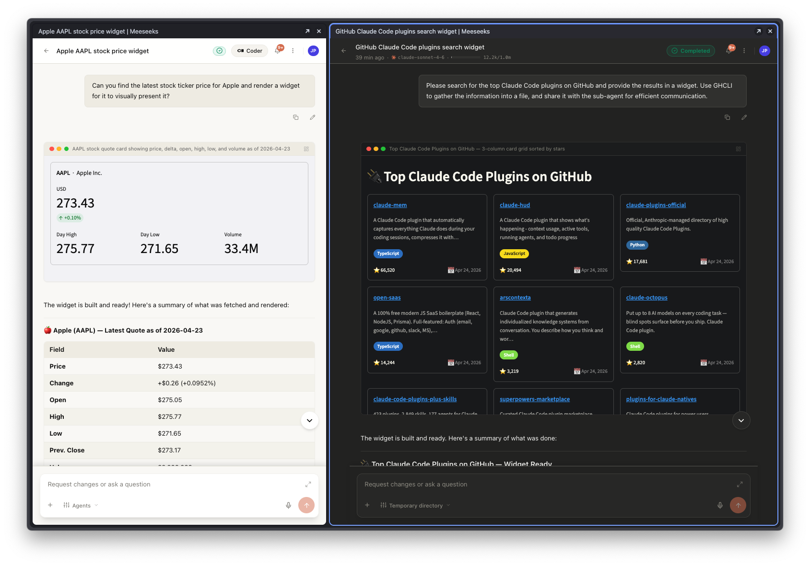

  

<h1 align="center">Mewbo</h1>

<em>Open-source, self-hosted AI orchestration system for long-horizon work. Parallel sub-agents you can scope, observe, and steer, with durable context and provider-agnostic model routing.</em>

    
    
    
    
    
    
    

https://github.com/user-attachments/assets/78754e8f-828a-4c54-9e97-29cbeacbc3bc

<table align="center">
    <tr>
        <td align="center"></td>
        <td align="center"></td>
    </tr>
    <tr>
        <td align="center"></td>
        <td align="center"></td>
    </tr>
    <tr>
        <td align="center"></td>
        <td align="center"></td>
    </tr>
    <tr>
        <td colspan="2" align="center"></td>
    </tr>
    <tr>
        <td colspan="2" align="center"></td>
    </tr>
</table>

## Overview

Mewbo is an open-source, self-hosted AI orchestration system for long-horizon work. Tasks decompose into parallel sub-agents that each carry only the tools they need, exchange compressed summaries instead of raw transcripts, and run within resource budgets you tune per deployment. You approve destructive actions, watch the agent tree as it grows, and can interrupt or steer any branch mid-flight. Sessions persist with full provenance, compact automatically near the budget, and survive across every client.

## Features

- **Agent hypervisor.** Sub-agents spawn in parallel with scoped tools and approval-gated actions. Progress shows as a live tree, and you can steer or cancel any branch mid-flight. The hypervisor enforces resource budgets through natural-language warnings rather than force-kills, and resolves every child into a structured result.
- **Long-horizon context.** Two-mode compaction summarises older turns near the budget. Post-compact file restoration replays the working set. Conversation fork lets you branch from any message and replay against a different model.
- **Native skills, plugins, and MCP.** Agent Skills, plugins from any compatible marketplace, and MCP servers load from user or project scope without translation. Plugins also contribute per-session stateful tools, hooks, and agent definitions.
- **Inline interactive widgets.** Sub-agents author Streamlit-in-WASM widgets that mount in a sandboxed Web Worker inside the conversation, with no server round-trip and no CORS.
- **Provider-agnostic, multi-surface.** Any model behind LiteLLM, accessed from a terminal CLI, web console, REST API, Home Assistant, Nextcloud Talk, or email. Same session, same tools, same transcript.

## Get started

See [docs.mewbo.com/getting-started](https://docs.mewbo.com/getting-started/) to install Mewbo and run a first session.

## Documentation

Full documentation lives at **[docs.mewbo.com](https://docs.mewbo.com/)**.

| Section | Covers |
| --- | --- |
| [Get Started](https://docs.mewbo.com/getting-started/) | Install, configure an LLM, run a first session. |
| [Configure](https://docs.mewbo.com/configuration/) | LLM setup, project config, configuration reference. |
| [Clients](https://docs.mewbo.com/clients-cli/) | CLI, web console, REST API, Home Assistant, Nextcloud Talk, email. |
| [Capabilities](https://docs.mewbo.com/features-builtin-tools/) | Built-in tools, sub-agents, skills, plugins, widgets, plan mode, permissions, compaction. |
| [Deploy](https://docs.mewbo.com/deployment-docker/) | Docker Compose, storage backends, production setup. |
| [Develop](https://docs.mewbo.com/core-orchestration/) | Architecture, session runtime, building a client, API reference. |
| [Releases](https://github.com/bearlike/Assistant/releases) | Release notes and upgrade history. |

## Contributing

Bugs and feature requests on the [issue tracker](https://github.com/bearlike/Assistant/issues). For development setup, see the [developer guide](https://docs.mewbo.com/developer-guide/).

## License

[MIT](LICENSE) © Krishnakanth Alagiri.
