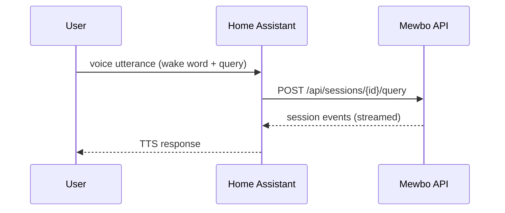

# Home Assistant Voice (HA Assist)

<figure><figcaption>Sensor information surfaced in HA Assist</figcaption></figure>

<figure><figcaption>Controlling entities by voice</figcaption></figure>

The Home Assistant integration lives in [`apps/mewbo_ha_conversation/`](repo:apps/mewbo_ha_conversation) and proxies voice requests to the API. It is designed for hands-free voice control: HA handles wake words and intent capture, then forwards the request to the API for orchestration and responses.

See [Get Started](getting-started.md#ha-setup) for installation prerequisites.

## How it works

Voice requests flow through the HA Assist pipeline, which forwards the transcript to the Mewbo API. The API runs the orchestration loop and returns a text response that HA Assist reads aloud.

The custom component handles session creation and maps HA conversation threads to Mewbo sessions via session tags.

## Install the custom component
1. Ensure the API is running (see [Web + API](clients-web-api.md)).
2. Copy the contents of [`apps/mewbo_ha_conversation/`](repo:apps/mewbo_ha_conversation) into Home Assistant under
   `custom_components/mewbo_conversation/`.
3. In Home Assistant, add the "Mewbo" conversation integration and set:
   - Base URL: the API base URL (for example, `http://host:5125`). The Docker stack publishes the API on host port 5125; a local `uv run mewbo-api` dev server listens on 5124.
   - API key: the API master token (`api.master_token` in `configs/app.json`). The component sends it on every request as the `X-API-Key` header.

## Optional: enable the Home Assistant tool
If Mewbo should control Home Assistant entities directly:
- Set `home_assistant.enabled` to `true` in `configs/app.json`.
- Provide the Home Assistant URL and token in `home_assistant.*`.
