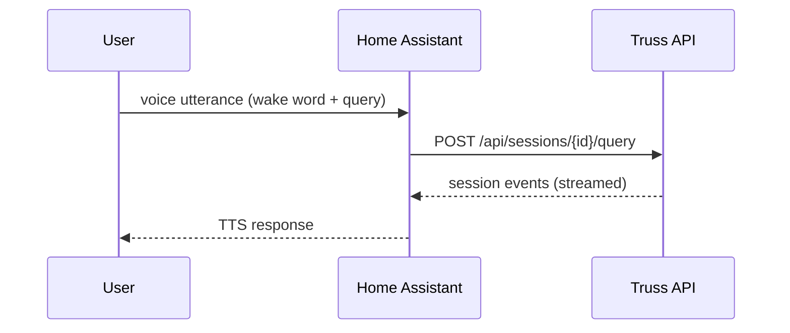

# Home Assistant Voice (HA Assist)

  
  

The Home Assistant integration lives in `truss_ha_conversation/` and proxies voice requests to the API. It is designed for hands-free voice control: HA handles wake words and intent capture, then forwards the request to the API for orchestration and responses.

See [Get Started](getting-started.md#ha-setup) for installation prerequisites.

## How it works

Voice requests flow through the HA Assist pipeline, which forwards the transcript to the Truss API. The API runs the orchestration loop and returns a text response that HA Assist reads aloud.

The custom component handles session creation and maps HA conversation threads to Truss sessions via session tags.

## Install the custom component
1. Ensure the API is running (see [Web + API](clients-web-api.md)).
2. Copy the contents of `truss_ha_conversation/` into Home Assistant under
   `custom_components/truss_conversation/`.
3. In Home Assistant, add the "Truss" conversation integration and set:
   - Base URL: the API base URL (for example, `http://host:5123`).
   - API key: the API master token (`api.master_token` in `configs/app.json`).

## Optional: enable the Home Assistant tool
If Truss should control Home Assistant entities directly:
- Set `home_assistant.enabled` to `true` in `configs/app.json`.
- Provide the Home Assistant URL and token in `home_assistant.*`.
