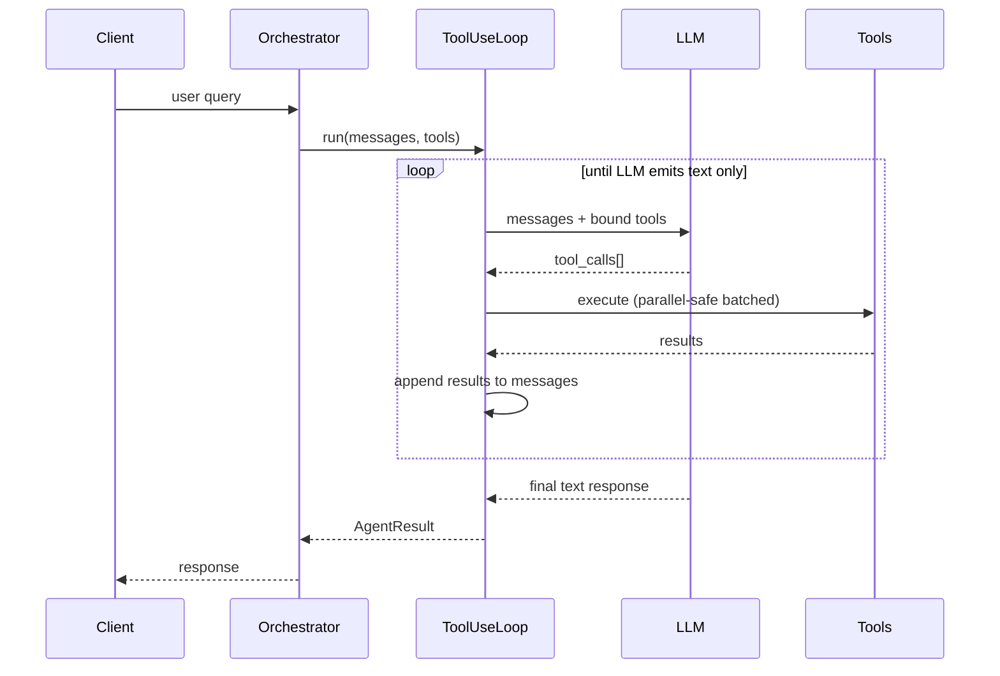
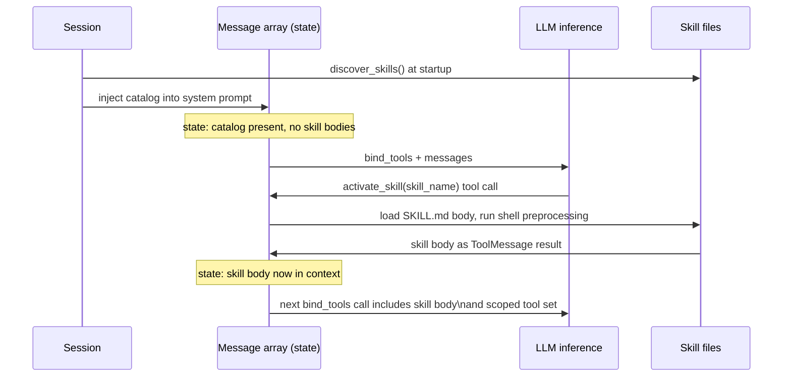
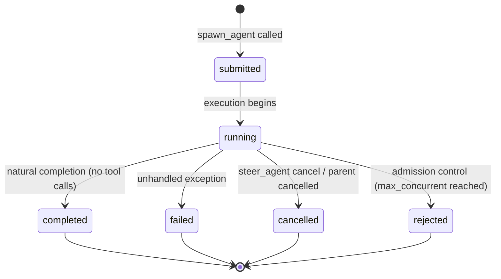
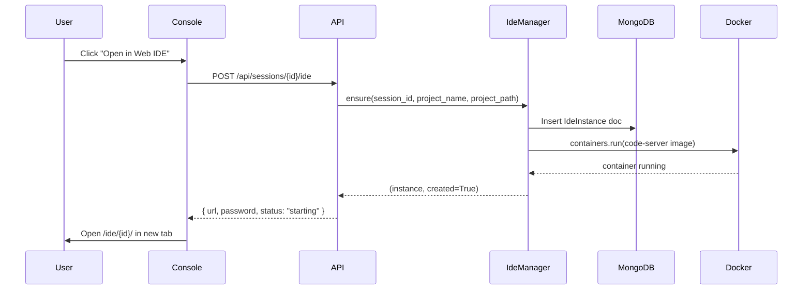
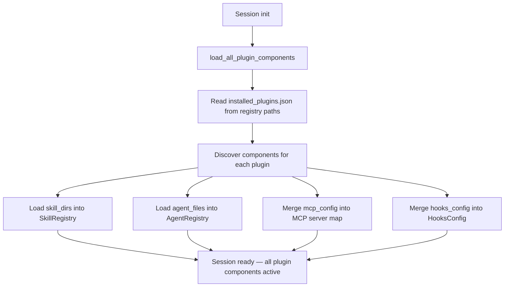

# Architecture Overview

This page is the canonical internals document for Meeseeks. It is written for developers embedding the core as a library, contributing new tools or channel adapters, or debugging session behaviour. Every other page in the documentation describes *what* a feature does; this page describes *how* each feature is implemented, which modules own the behaviour, and which data structures survive compaction or restart.

If you are setting up the product, start at [Get Started](getting-started.md). If you are looking up a capability, browse the [Capabilities](features-builtin-tools.md) section. The Feature pages link back here for the implementation detail they intentionally omit.

---

## Execution model

Meeseeks uses a single async execution engine for every agent at every depth: `ToolUseLoop`. There is no separate planner, executor, or synthesiser — the LLM drives tool selection via native `bind_tools`, and the orchestration layer steps the message array forward.

The loop runs until the LLM emits a text response with no tool calls. Budget warnings are injected as `SystemMessage` entries as the session approaches limits — the loop is never force-killed.



**Tool concurrency** — Tools are partitioned into concurrent-safe batches and exclusive calls. Concurrent-safe tools execute in parallel with `asyncio.gather`. Exclusive tools run alone. Each tool has a configurable timeout (default 120 s); a timeout does not cancel sibling calls.

### Core components

| Component | Role |
|-----------|------|
| `Orchestrator` | Session lifecycle, context building, and mode resolution. |
| `ToolUseLoop` | Async tool-use conversation loop — the single execution engine at every depth. |
| `AgentContext` | Immutable per-agent state propagated through the hierarchy. |
| `AgentHypervisor` | Control plane: admission control, lifecycle tracking, cancellation, cleanup. |
| `SpawnAgentTool` | Sub-agent creation with tool scoping (allowlist/denylist filtered before binding). |
| `Planner` | Plan generation via LLM (plan mode only). |
| `SessionRuntime` | Shared facade used by both CLI and API. |
| `SessionStore` | Transcript and summary storage. |
| `ToolRegistry` | Local tools plus external MCP tools, with `filter_specs()` for allow/deny. |

### Execution flow

Input arrives from a client (CLI, API, or a chat-platform adapter). The orchestrator builds a context snapshot (summary, recent events, selected history). In act mode, a single async `ToolUseLoop` executes. In plan mode, the `Planner` generates a plan without execution. The LLM can spawn sub-agents via `spawn_agent` for parallel sub-tasks, managed by the `AgentHypervisor`. Results are written to the session transcript.

---

## Instruction loading {#instruction-loading}

`discover_all_instructions()` performs an **upward pass** from the current working directory to the git root (or filesystem root) and loads instruction files in priority order (higher priority wins):

| Priority | Path | Scope |
|----------|------|-------|
| 10 | `~/.claude/CLAUDE.md` | User-global, all projects |
| 20–29 | `CLAUDE.md` / `.claude/CLAUDE.md` walking up from CWD | Project hierarchy; CWD = 20, parent = 21, … |
| 30 | `.claude/rules/*.md` (all files, sorted) | Project-local rule set |
| 40 | `CLAUDE.local.md` | Machine-local override (gitignore this) |

The full text of each file is concatenated and injected into the system prompt before the first LLM call. Each source is separated by a heading so content is traceable. When both `CLAUDE.md` and `AGENTS.md` exist at the same path, `CLAUDE.md` takes precedence.

`discover_subtree_instructions()` performs a **downward pass** from CWD to a maximum depth of 5, scanning for `CLAUDE.md`, `AGENTS.md`, and `.claude/CLAUDE.md`. Content is **not** injected — only paths. The system prompt receives an index like:

```
# Sub-package instruction files
- packages/meeseeks_core/CLAUDE.md
- apps/meeseeks_console/CLAUDE.md
```

When a later tool call targets a file inside `packages/meeseeks_core/`, the model's next prediction produces a `read_file` call that pulls the relevant `CLAUDE.md` into the message array as a tool result. This keeps large monorepos manageable — only directly applicable instructions occupy the active context.

Pruned directories (never walked): `node_modules`, `__pycache__`, `.venv`, `venv`, and all dotfile directories. A `<!-- meeseeks:noload -->` marker on line 1 of any instruction file excludes it from both passes.

`get_git_context()` collects branch, working-tree status, and recent commits. It is available as a helper; individual integrations decide whether to include it.

---

## Skill loading {#skill-loading}

Skills use a two-stage lazy-load pattern. A catalog (name + description only) is injected into the system prompt at session start. The full `SKILL.md` body enters the message array as a `ToolMessage` only when `activate_skill` is called.



When `allowed-tools` is set on a skill, activation replaces the full tool list using the same `filter_specs()` mechanism that sub-agent spawning uses. Shell preprocessing (`` !`command` ``) executes each matched command (30-second timeout) and substitutes stdout into the body before it is handed to the model; errors become `[ERROR: ...]` placeholders.

The skill registry checks file modification times and reloads changed files between sessions. New skill directories appearing while the server runs are detected on the next scan.

---

## Sub-agents and the hypervisor {#sub-agents}

Every session has a single `AgentHypervisor` instance shared across the entire agent tree. It has two layers.

**Reflexes (code-level watchdog)** — A background check runs every 30 seconds and examines all running agents for stalls (no tool call within the stall threshold, default 120 s). When a stall is detected, a `SystemMessage` warning is injected into the stalled agent's queue. Budget enforcement is similarly graduated: as `session_step_budget` is approached, warnings are injected; the loop is never hard-killed. This preserves accumulated context.

**Brain (global eye)** — The root agent's system prompt is rebuilt each step and includes `render_agent_tree()` — a compact live view of the entire agent tree with status, steps completed, last tool, and progress notes. The root can read this at any time via `check_agents` without an extra LLM call. Compaction events are tracked per agent (`compaction_count`, `last_compacted_at`) and visible in the tree view.

### Lifecycle



Agents run until the model returns a text response with no tool calls — **natural completion**. There is no hard step limit; safety comes from `agent.llm_call_timeout`, stall detection, and `agent.session_step_budget`.

### Spawning semantics

Root spawns (depth = 0) are non-blocking: the call returns `{agent_id, status: "submitted"}` immediately and `_run_child_lifecycle` stores the `AgentResult` on the `AgentHandle` when the child finishes. Sub-agent spawns (depth ≥ 1) are blocking and return an `AgentResult` JSON payload inline.

`spawn_agent(task, model, allowed_tools, denied_tools, acceptance_criteria, agent_type)` — the `max_steps` parameter is deprecated and not enforced. Sub-agents inherit the parent's `approval_callback` so write, edit, and shell tools work in API and headless contexts.

### AgentResult

| Field | Type | Description |
|---|---|---|
| `content` | string | Primary output text |
| `status` | string | `completed`, `failed`, `partial`, or `cannot_solve` |
| `steps_used` | integer | Number of tool steps executed |
| `summary` | string | Compressed summary (≤ 500 chars) for parent context |
| `warnings` | array | Non-fatal issues encountered |
| `artifacts` | array | File paths touched by the agent |

### Depth roles

Each depth level has a distinct behavioural role injected into the system prompt via `_build_depth_guidance()`:

| Depth | Role | Behaviour |
|---|---|---|
| 0 (root) | Hypervisor / orchestrator | Direct execution by default; async delegation when spawning; steer / cancel running agents; synthesize results |
| 1–4 (mid) | Sub-orchestrator | Bounded scope; may further delegate |
| 5 (leaf) | Executor | Complete task directly; self-terminate; admit failure explicitly |

At depth 5 the `spawn_agent` tool is removed from the schema entirely — the LLM cannot attempt further delegation.

### Messaging

| Direction | Mechanism |
|---|---|
| Parent → child | `steer_agent` (root only) or `send_message(agent_id, text)` |
| Child → parent | Automatic on completion via `send_to_parent(child_id, text)` |
| System → agent | Hypervisor injects budget warnings and stall nudges as `HumanMessage` |
| User → root | `message_queue` (thread-safe `queue.Queue`), `interrupt_step` (`threading.Event`). Drained between steps as `HumanMessage`. Exposed via `/message` and `/interrupt`. Created in `RunRegistry.start()`. |

Messages are drained between tool steps — they never interrupt an in-flight tool call.

### Compaction resilience

Sub-agent state survives compaction because it lives outside the LLM conversation history. The agent tree is rebuilt each step into the root system prompt from live `AgentHandle` state. `check_agents` reads `AgentHandle` directly in memory. Completed child results are stored on `AgentHandle.result` and re-injected after compaction. Compaction never loses track of running or completed sub-agents.

### Cleanup and structured errors

Cleanup runs in three phases (cancel → wait with timeout → force-mark as cancelled). `await_lifecycle_managers(timeout)` runs before event-loop teardown. `AgentError` captures `agent_id`, `depth`, `task`, `message`, `last_tool`, `steps`. Sub-agent cleanup cascades to children before unregistering.

On root step-limit with pending non-blocking children, a 2-second grace period applies before completed results are injected as a `SystemMessage` for synthesis; still-running agents are named in the warning prompt.

---

## Permission policy {#permission-policy}

Every tool call is represented as an `ActionStep` with a `tool_id` and an `operation` (e.g. `get`, `set`). Before the tool runs, `PermissionPolicy.decide()` walks a list of `PermissionRule` entries and returns `allow`, `deny`, or `ask`. Rules are evaluated in order; the first match wins.

Matching uses `fnmatch` glob patterns on both `tool_id` and `operation`. If no rule matches, the policy falls back to per-operation defaults (`get` → `allow`, `set` → `ask`), then to a catch-all `default_decision`.

`permissions.approval_mode` sets a session-wide shortcut that overrides the policy file: `allow` (also `auto`, `approve`, `yes`), `deny` (also `never`, `no`), or `ask` (default).

---

## Hook manager {#hook-manager}

`HookManager` dispatches hooks at lifecycle points and around individual tool calls. Every invocation is wrapped in `try/except` — a failing hook logs a warning and never blocks execution. `HookManager.load_from_config()` wires external hooks declared in `HooksConfig` into the manager; the API server calls this at startup and passes `hook_manager` to every `start_async()` call.

Two hook types:

- **Command hooks** — Shell subprocess. `_session_env()` provides `MEESEEKS_SESSION_ID`, `MEESEEKS_ERROR`, `MEESEEKS_TOOL_ID`, `MEESEEKS_OPERATION`, and `MEESEEKS_TOOL_RESULT` (first 2 000 chars). Waits up to `timeout` seconds (default 30), then moves on.
- **HTTP hooks** — Fire-and-forget JSON POST to an external URL in a daemon thread. Does not block execution; failures are logged.

An optional `matcher` (fnmatch pattern) restricts which tool IDs trigger the hook. `matcher: "mcp__*"` restricts to all MCP tools; omitting the matcher matches every call.

Lifecycle events: `on_session_start`, `on_session_end`, `pre_tool_use`, `post_tool_use`. `on_compact` is fired programmatically from the compaction path; it is not configurable via `HooksConfig` but can be registered in code.

---

## Plan mode signals {#plan-mode}

In plan mode, the LLM binds only read-only tools plus the `exit_plan_mode` signal. Writes are blocked. Once the model calls `exit_plan_mode`, `ToolUseLoop` emits a `plan_proposed` event and terminates the run, waiting for a decision.

Approval emits `plan_approved` and starts a new act-mode run. Rejection emits `plan_rejected`; free-text feedback is provided to the model as context for a revised plan.

Plan approval is **episodic**: approval and rejection events persist in the session transcript and survive process restarts. `SessionRuntime.resolve_session()` checks for unresolved `plan_proposed` events before starting a new run.

Each `exit_plan_mode` call increments a per-session counter stored at `<plan_dir>/revision.txt`. The revision number appears in `plan_proposed` events so the UI can distinguish between first drafts and revised plans.

### Shell allowlist

During exploration Meeseeks enforces a shell allowlist via `agent.plan_mode_shell_allowlist`. Only commands whose first token matches a configured prefix are permitted. Commands containing an unquoted pipe (`|`), redirect (`>`, `<`), chain (`&`, `;`), variable expansion (`$`), or command substitution (`` ` ``) are rejected regardless of the allowlist. Prefixes match at word boundaries — `"git log"` matches `"git log --oneline"` but not `"git logger"`. An empty list blocks shell access entirely.

`agent.plan_mode_allow_mcp` defaults to `true`; MCP tools are available in plan mode unless explicitly disabled.

---

## Compaction pipeline {#compaction}

Compaction has two modes:

- **`PARTIAL`** — default for auto-compact. Keeps the most recent `context.recent_event_limit` events verbatim (default 8). Everything older is summarised.
- **`FULL`** — summarises the entire transcript, including recent events. Clean-slate prompt.

The compaction LLM receives the raw event transcript and produces a structured response in two XML sections:

```xml
<analysis>
  [Reasoning about what to preserve vs discard — removed before storing]
</analysis>

<summary>
## Primary Request
## Key Technical Concepts
## Files and Code
## Errors and Fixes
## Current State
## Pending Tasks
</summary>
```

Only the `<summary>` block is stored. The `<analysis>` scratchpad is stripped before injection into subsequent prompts.

After the summary is generated, Meeseeks scans summarised events for file paths referenced by tool calls and re-reads up to 5 files (up to 5 000 tokens each) back into the compacted context. Recently edited files land in the prompt as literal content so the model can continue editing without re-reading them.

**Caveman mode** (`compaction.caveman_mode = true`) activates a terse summarisation prompt that drops articles, filler phrases, and hedging while preserving code blocks, file paths, URLs, commands, and error strings verbatim. Output tokens drop by ~30–60 % on prose-heavy sessions without changing the XML structure.

Each compaction emits a `context_compacted` event with payload `{model, tokens_before, tokens_saved, events_summarized}`. The console timeline renders compaction events as a distinct pill; the context-window bar popover includes a **Compactions** row when at least one has run.

Auto-compact fires when the most recent root prompt size crosses `token_budget.auto_compact_threshold` (default 0.8 of the model's context window). The threshold is evaluated after every LLM call using the actual `input_tokens` reported by the provider — not a character-count estimate.

---

## Token tracking {#token-tracking}

Meeseeks tracks usage separately for the root agent (depth = 0) and all sub-agents (depth ≥ 1). Three distinct input-token semantics:

| Semantic | Fields | When to use |
|----------|--------|-------------|
| Context fill (now) | `root_last_input_tokens` | Current window pressure — drives the fill bar and "until compact" display |
| Context pressure (peak) | `root_peak_input_tokens`, `sub_peak_input_tokens` | Worst-case historical pressure — popover secondary stat |
| Billable (cost) | `*_input_tokens_billed` | Cumulative sum across all calls — cost dashboards |

Do **not** sum `input_tokens` across calls within a turn — the prompt grows as tool results accumulate (each step re-sends the full context), so summing double-counts the baseline. Use the peak or the last value. Output tokens are always additive — each output token is produced once.

Prompt caching auto-enables via LiteLLM for models that report support. No configuration is required. Meeseeks queries `litellm.utils.supports_prompt_caching` to decide whether to enable caching for a given model name.

When using a proxy (`llm.api_base` set), the proxy must expose `/v1/model/info` advertising each model's capabilities. Meeseeks fetches this endpoint once per process at startup and registers the results with LiteLLM so `supports_prompt_caching` returns accurate results for proxy-routed custom model names. Without `/v1/model/info`, caching falls back to disabled for those models.

---

## MCP connection pool {#mcp}

MCP server definitions are assembled from four layers, merged deepest-first with deep-merge semantics (later layers win on key conflicts):

| Layer | Source | Priority |
|-------|--------|----------|
| 1 | Plugin-contributed servers | Lowest |
| 2 | Global: `configs/mcp.json` or `$MEESEEKS_HOME/mcp.json` | — |
| 3 | Subtree `.mcp.json` files, deepest-first | — |
| 4 | CWD `.mcp.json` | Highest |

The session's project directory is passed as `cwd` to `MCPToolRunner`. Each `connect_all` call re-invokes `get_merged_mcp_config(cwd)` and hashes the merged result with SHA-256; changed or new servers reconnect, removed servers disconnect, unchanged servers keep their existing connections.

### Config normalization

All `.mcp.json` files are normalised before merging:

| Input field | Normalized to | Notes |
|-------------|---------------|-------|
| `mcpServers` | `servers` | Claude Code / VS Code schema compatibility |
| `type` | `transport` | Both removed after normalization to avoid leaks |
| `http_headers` | `headers` | — |
| `transport: "http"` | `transport: "streamable_http"` | Legacy alias |
| `command` present, no `transport` | `transport: "stdio"` | Inferred |
| `${VAR}` / `$VAR` in values | Expanded from process environment | Unresolved vars left as-is |

### Pool behaviour

| Behaviour | Detail |
|-----------|--------|
| Persistent connections | One `MultiServerMCPClient` per server, reused across all requests. |
| Auto-reconnect | After 3 consecutive call errors on a server, the pool invalidates it and attempts a single reconnect before retrying the failed call. |
| Config change detection | Config hash is compared on each `connect_all` call. |
| Connect timeout | 30 seconds per server. |
| Call timeout | 60 seconds per tool invocation. |
| Concurrent connects | Up to 5 servers connect in parallel at startup. |

The legacy one-shot client is a fallback when the pool is unavailable.

---

## LSP tool {#lsp}

`lsp_tool` is backed by `pygls` and `lsprotocol`. When these optional dependencies are absent, the tool is silently disabled on startup — no crash, no error.

Servers are auto-discovered via `shutil.which` and spawned lazily per-session on the first request for a matching file type. A server that fails to start is added to a `_failed` set and is not retried for the lifetime of the session. `shutdown_all()` terminates running servers at session end.

The manager walks up from CWD looking for each server's `root_markers`. If no marker is found within 20 directory levels, CWD itself becomes the workspace root.

Passive diagnostics run via an `_append_lsp_feedback` hook inside `ToolUseLoop` after every file edit. The diagnostics are appended to the context as a tool result — the LLM sees type errors and lint warnings in the same turn it wrote the edit, with no explicit `lsp_tool` call required. Disable by setting `agent.lsp.enabled` to `false`.

Custom servers defined under `agent.lsp.servers` specify `command`, `extensions`, and optionally `root_markers` and `language_id`. Disable a built-in server with `{"pyright": {"disabled": true}}`.

---

## Web IDE manager {#web-ide}

`IdeManager` manages per-session code-server containers. State is persisted in the `ide_instances` MongoDB collection so the IDE survives API restarts and multiple browser tabs. The Web IDE feature requires MongoDB as the storage backend.

The API container needs access to the Docker socket (`/var/run/docker.sock`) to spawn sibling code-server containers. In the Docker Compose stack this is wired automatically.



The session's project directory is mounted at `/home/coder/project`. A deadline file is bind-mounted at `/meeseeks/deadline`; the container's internal watchdog reads it on a 15-second interval and self-terminates when the epoch passes. `POST /api/sessions/{id}/ide/extend` overwrites the deadline file and updates MongoDB. `DELETE` force-removes the container, deadline file, and MongoDB document.

---

## Built-in tools {#built-in-tools}

### read_file cache

`read_file` maintains a per-session cache keyed by `(path, offset, limit)`. If the session calls `read_file` on the same slice twice without any intervening edit to that file, the second call returns immediately from cache without re-reading or re-emitting the content into the context window. In real sessions this cuts 60–99 % of context consumed by repeated reads of the same large file.

### Tool output schemas

Each built-in tool returns a JSON payload tagged with `kind`:

```json
// read_file
{"kind": "file", "path": "...", "text": "1\t...", "total_lines": 42}

// aider_shell_tool
{"kind": "shell", "command": "...", "cwd": "...", "exit_code": 0,
 "stdout": "...", "stderr": "", "duration_ms": 423}

// aider_list_dir_tool
{"kind": "dir", "path": "...", "entries": ["..."]}

// aider_edit_block_tool / file_edit_tool
{"kind": "diff", ...}
```

### Edit tool selection

Both edit backends share `edit_common.py` and emit `{"kind": "diff", ...}`. `AgentConfig.edit_tool` selects `"search_replace_block"` or `"structured_patch"`. When empty (default), `ToolUseLoop._configured_edit_tool_id()` auto-selects based on model identity via `llm.model_prefers_structured_patch()`. The tool schema, LLM prompt instructions, and backend implementation all switch together — they are bundled in the same `ToolSpec` registration.

Extend which models receive the structured-patch backend via `llm.structured_patch_models` (accepts wildcards): `["my-custom-model*", "openai/gpt-5"]`.

---

## Plugin loading {#plugins}



`load_all_plugin_components()` runs during session initialisation. It reads the installed-plugins registry file, discovers each plugin's directory, and fans contributions into the live registries. The result is cached by registry-file mtime — repeated calls within the same process are free unless a plugin was installed or uninstalled.

`${CLAUDE_PLUGIN_ROOT}` in a plugin's `.mcp.json` or `hooks/hooks.json` is substituted at discovery time with the plugin's installation directory.

**Precedence** — Plugin skills do not override personal (`~/.claude/skills/`) or project-local (`.claude/skills/`) skills with the same name. Plugin MCP servers are merged additively — later plugins do not overwrite earlier ones for the same server name. Plugin hooks are format-translated and merged into the live `HooksConfig`.

`PluginsConfig` lives in `config.py` and defines `registry_paths` and `marketplaces`. The CLI exposes `/plugins`; the API exposes `GET/POST /api/plugins`, `GET/POST /api/plugins/marketplace`, and `DELETE /api/plugins/<name>`; the console renders `PluginsView`.

---

## Channel adapters {#channel-adapters}

Chat-platform adapters implement the `ChannelAdapter` protocol (`channels/base.py`):

| Method / property | Purpose |
|---|---|
| `verify_request` | Authenticate an inbound request (HMAC for webhooks) |
| `parse_inbound` | Produce a normalised `InboundMessage` |
| `send_response` | Deliver the final answer back to the channel |
| `system_context` | Injected into the LLM system prompt — makes the model aware it is communicating through this adapter |

`ChannelRegistry` lookup and `DeduplicationGuard` replay protection are shared. The webhook endpoint `POST /api/webhooks/<platform>` authenticates via HMAC (not API key). Poll-driven channels (e.g. Email) call `_process_inbound()` directly from their own poller instead of via the webhook route.

The shared `_process_inbound()` pipeline in `routes.py` runs dedup → mention gate → session resolve → commands → LLM for every channel. `requires_mention(message)` is optional on the adapter for dynamic mention gating (Email uses this to skip the `@Meeseeks` requirement on 1-to-1 threads).

Channel sessions are standard API sessions — created via `session_store.create_session()`, mapped via session tags (`tag_session` / `resolve_tag`), visible in the console and Langfuse. The completion callback reads `source_platform` from the transcript context event and dispatches the final answer through the adapter.

Existing adapters: Nextcloud Talk (`nextcloud_talk.py`, HMAC-SHA256, ActivityStreams 2.0, OCS Bot API) and Email (`email_adapter.py`, IMAP polling + SMTP reply, markdown-to-HTML rendering via `mistune`, Jinja2 HTML template).

---

## Extensibility points

- **Tools** — Implement `AbstractTool` or register an MCP server with a schema.
- **File edit tool** — Set `agent.edit_tool` to `"search_replace_block"` or `"structured_patch"`, or leave empty for auto-selection.
- **Plugins** — Install from configured marketplaces; see [Plugins & Marketplace](features-plugins.md).
- **Web IDE** — Opt-in per-session code-server containers via `agent.web_ide`; see [Web IDE](features-web-ide.md).
- **Hooks** — Shell command (`type: "command"`) or HTTP webhook (`type: "http"`); see [Permissions & Hooks](features-permissions-hooks.md).
- **Interfaces** — Reuse `SessionRuntime` and the event transcript model.
- **Chat platforms** — Implement `ChannelAdapter`, register in `init_channels()`; see [Nextcloud Talk](clients-nextcloud-talk.md) and [Email](clients-email.md).
- **LSP** — Add a custom server under `agent.lsp.servers` with `command`, `extensions`, `root_markers`.

## Further reading

- [Session Runtime](session-runtime.md) — the shared facade used by CLI and API.
- [Building a Client](developer-guide.md) — full walkthrough for embedding the core.
- [API Reference](reference.md) — mkdocstrings reference for every module.
