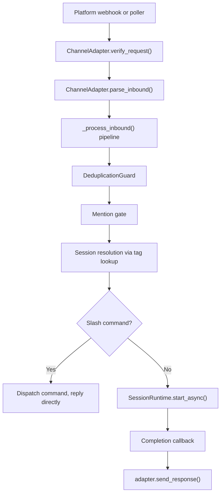

# Developer Guide

This page summarizes the code layout, core interfaces, and the minimal steps needed to build a new client.

## Monorepo layout
- `packages/meeseeks_core/`: orchestration loop, session runtime, schemas, session storage, compaction, tool registry, plugin system (`plugins.py`), agent definition registry (`agent_registry.py`).
- `packages/meeseeks_tools/`: tool implementations and integration glue.
- `packages/meeseeks_tools/src/meeseeks_tools/vendor/aider`: vendored Aider utilities used by local file and shell tools.
- `apps/meeseeks_api/`: Flask API that exposes the assistant over HTTP, plugin management endpoints, Web IDE lifecycle (`ide.py`, `ide_routes.py`).
- `apps/meeseeks_console/`: Web console for task orchestration, plugin management, and Web IDE access (React + Vite).
- `apps/meeseeks_cli/`: terminal CLI for interactive sessions.
- `meeseeks_ha_conversation/`: Home Assistant integration that routes voice requests to the API.

## Project instructions (`CLAUDE.md` / `AGENTS.md`)

The orchestrator loads project instructions from the working directory and injects them into the system prompt. `discover_project_instructions()` in `meeseeks_core.common` checks for `CLAUDE.md` first, then falls back to `AGENTS.md`.

- Place a `CLAUDE.md` at the repo root or in any sub-package to provide context-specific guidance to the orchestration loop.
- `AGENTS.md` is a fallback for tools that look for that filename. In this repo the `AGENTS.md` files are shims that redirect to `CLAUDE.md`.
- To **skip** a file from being loaded (e.g., a shim that would duplicate content), add `<!-- meeseeks:noload -->` as the very first line. The loader checks for this marker and skips the file.

## Model and provider support
- **Model gateway:** Uses LiteLLM for OpenAI-compatible access across multiple providers.
- **Reasoning compatibility:** Applies reasoning-effort controls where supported by the model.
- **Model routing:** Supports provider-qualified model names and a configurable API base URL. Per-role model selection (plan, tool, default) is configured in `configs/app.json`.

## Core abstractions and interfaces
- `AbstractTool` (`meeseeks_core.classes`): base class for local tools; implement `get_state` and `set_state` and return a `MockSpeaker`.
- `ToolRunner` protocol (`meeseeks_core.tool_registry`): interface for tool runners with `run(ActionStep)`.
- `ToolSpec` / `ToolRegistry` (`meeseeks_core.tool_registry`): register tools with `tool_id`, metadata, and a factory. The file edit tool is conditionally registered based on `agent.edit_tool` config — either `aider_edit_block_tool` or `file_edit_tool`. When `edit_tool` is empty, `ToolUseLoop` auto-selects based on model identity via `model_prefers_structured_patch()`. The `read_file` tool is always registered as a native built-in (see [Built-in `read_file` tool](#built-in-read_file-tool) below).
- `PluginSystem` (`meeseeks_core.plugins`): discovers, installs, and uninstalls plugins from configured marketplaces. Plugins contribute agent definitions (parsed by `agent_registry.py`), skills, hooks, and MCP tool configurations. Loaded via `load_all_plugin_components()` during session init.
- `ActionStep`, `Plan`, `TaskQueue` (`meeseeks_core.classes`): planning and tool-execution payloads.
- `PermissionPolicy` (`meeseeks_core.permissions`): allow/deny/ask rules for tool execution.
- `HookManager` (`meeseeks_core.hooks`): pre/post hooks, compaction transforms, and session lifecycle hooks. Supports `"command"` (shell) and `"http"` (fire-and-forget POST) hook types via `HooksConfig`.
- `ChannelAdapter` protocol (`meeseeks_api.channels.base`): abstraction for chat platform integrations with four methods (`verify_request`, `parse_inbound`, `send_response`, `system_context`). All adapters share the `_process_inbound()` pipeline in `routes.py`. Current adapters: Nextcloud Talk (webhook-driven) and Email (IMAP polling with SMTP replies rendered as HTML from markdown).
- `SessionStore` / `SessionRuntime` (`meeseeks_core.session_store`, `meeseeks_core.session_runtime`): transcripts and the shared runtime facade.
- `ChatModel` protocol (`meeseeks_core.llm`): interface for LLM backends via `build_chat_model`. Supports `proxy_model_prefix` for proxy routing and `model_prefers_structured_patch()` for edit tool auto-selection.
- `LSPTool` (`meeseeks_tools.integration.lsp.tool`): code intelligence via pygls language servers. Operations: `diagnostics`, `definition`, `references`, `hover`. Servers are `ServerDef` instances in `lsp/servers.py`, matched by file extension and auto-discovered on the PATH. Passive diagnostics are injected after file edits via `_append_lsp_feedback` in `ToolUseLoop`. Config: `agent.lsp.enabled` and `agent.lsp.servers` (override built-ins or add custom servers). Requires the `pygls` optional dependency; silently absent when not installed.

## New client walkthrough (concrete steps)
1. Load config and initialize core services:
   - `load_registry()` for tool registration.
   - `load_permission_policy()` and `approval_callback_from_config()` for approvals.
   - `SessionStore()` and `SessionRuntime()` for transcripts and runs.
2. Resolve or create a session id using `SessionRuntime.resolve_session()`.
3. Handle core slash commands (`/compact`, `/status`, `/terminate`) with `parse_core_command()`.
4. Execute the request:
   - `run_sync()` for synchronous use cases.
   - `start_async()` + `load_events(after=...)` for polling flows.
5. Emit and consume session events:
   - `action_plan` when a plan is generated.
   - `permission` decisions when approvals are requested or denied.
   - `tool_result` for each tool execution (includes `tool_id`, `operation`, `tool_input`, and `result`).
   - `step_reflection` when the reflector requests a revision.
   - `assistant` and `completion` for final output and status.
6. Logging:
   - Use `get_logger()` for module logging.
   - Use `session_log_context(session_id)` to capture per-session logs.

### Minimal sync example
```python
from meeseeks_core.common import get_logger
from meeseeks_core.permissions import approval_callback_from_config, load_permission_policy
from meeseeks_core.session_runtime import SessionRuntime, parse_core_command
from meeseeks_core.session_store import SessionStore
from meeseeks_core.tool_registry import load_registry

logger = get_logger("client")

session_store = SessionStore()
tool_registry = load_registry()
runtime = SessionRuntime(session_store=session_store)

session_id = runtime.resolve_session(session_tag="client")
user_text = "Hello from the client"
command = parse_core_command(user_text)
if command:
    logger.info("Handled command: {}", command)
else:
    result = runtime.run_sync(
        session_id=session_id,
        user_query=user_text,
        tool_registry=tool_registry,
        permission_policy=load_permission_policy(),
        approval_callback=approval_callback_from_config(),
    )
    logger.info("Task result: {}", result.task_result)
```

### Implementing a local tool
1. Subclass `AbstractTool` and implement `get_state` / `set_state`.
2. Register the tool with a `ToolSpec` factory in the registry.

```python
from meeseeks_core.classes import AbstractTool, ActionStep
from meeseeks_core.common import get_mock_speaker
from meeseeks_core.tool_registry import ToolRegistry, ToolSpec

class ExampleTool(AbstractTool):
    def __init__(self) -> None:
        super().__init__(name="Example", description="Example tool")

    def get_state(self, action_step: ActionStep | None = None):
        return get_mock_speaker()(content="Example read")

    def set_state(self, action_step: ActionStep | None = None):
        return get_mock_speaker()(content="Example write")

registry = ToolRegistry()
registry.register(
    ToolSpec(
        tool_id="example_tool",
        name="Example",
        description="Example local tool",
        factory=ExampleTool,
    )
)
```

## New channel adapter walkthrough

Channel adapters connect external chat platforms (Nextcloud Talk, Email, Slack, Discord, etc.) to Meeseeks. All adapters share the same inbound pipeline and produce standard API sessions visible in the console and Langfuse.

### Architecture



Key files in `apps/meeseeks_api/src/meeseeks_api/channels/`:

| File | Purpose |
|------|---------|
| `base.py` | `ChannelAdapter` Protocol, `InboundMessage` dataclass, `ChannelRegistry`, `DeduplicationGuard` |
| `routes.py` | Flask Blueprint, shared `_process_inbound()` pipeline, `@command` decorator registry, `init_channels()` |
| `nextcloud_talk.py` | Nextcloud Talk adapter (webhook-driven, HMAC-SHA256, ActivityStreams 2.0, OCS Bot API) |
| `email_adapter.py` | Email adapter (IMAP poll-driven, SMTP reply, markdown-to-HTML rendering via mistune) |

### Steps to add a new platform (e.g., Slack)

1. **Create the adapter** — `channels/slack.py` implementing `ChannelAdapter`:
   - `verify_request(headers, body)` — validate the inbound webhook signature.
   - `parse_inbound(headers, body)` — extract an `InboundMessage` from the platform payload. Return `None` for non-message events.
   - `send_response(channel_id, text, thread_id, reply_to)` — post the reply back to the platform.
   - `system_context` property — brief string injected into the LLM system prompt so it knows which interface the user is on.

2. **Add config** — add the platform section under `channels` in `configs/app.json`:
   ```json
   { "channels": { "slack": { "enabled": true, "bot_token": "xoxb-...", "signing_secret": "..." } } }
   ```

3. **Register in `init_channels()`** — instantiate the adapter and call `_registry.register()`. For webhook-driven platforms, the route `POST /api/webhooks/slack` works automatically via the shared Blueprint.

4. **For poll-driven channels** (like Email's IMAP poller): create a daemon thread that polls the external source and calls `_process_inbound()` directly, bypassing the webhook route.

5. **Optionally implement `requires_mention(message)`** — return `False` to skip the mention gate for specific message types (e.g., Email skips mentions for 1-to-1 but requires `@Meeseeks` in multi-party threads).

6. **Add platform-specific slash commands** (optional) — use the `@command` decorator in `routes.py`. Help text auto-generates from the registry.

### Session mapping

Channel sessions use session tags to map platform threads to Meeseeks sessions.

- **Tag format:** `"<platform>:<scope>:<id>"` (for example, `nextcloud-talk:room:abc123` or `email:thread:alice@example.com:msg-id-001`).
- The `_process_inbound()` pipeline calls `session_store.resolve_tag(tag)` to look up an existing session. If no session exists, it creates one with `create_session()` and binds it with `tag_session()`.
- A `context` event containing `source_platform` metadata is injected at creation. The completion callback reads this field to route the final response back through the correct adapter.
- Channel sessions are standard API sessions. They appear in the web console, support archiving, export, and forking, and show up in Langfuse traces.

### Built-in slash commands (all channels)

| Command | Description |
|---------|-------------|
| `/help` | List available commands |
| `/usage` | Show session token usage and context window utilization |
| `/new` | Start a fresh conversation (new session) |
| `/switch-project <name>` | Switch the active project context |

Commands run without LLM invocation. Adding a new command is one `@command` decorator and one function.

### Existing adapters

- **Nextcloud Talk** — see [docs/clients-nextcloud-talk.md](clients-nextcloud-talk.md)
- **Email** — see [docs/clients-email.md](clients-email.md)

## Built-in `read_file` tool

The `read_file` tool (`tool_id: "read_file"`) is a native built-in for reading local files with line-based windowing and a dedup cache that prevents redundant reads from bloating the LLM's context.

**Implementation:** `packages/meeseeks_tools/src/meeseeks_tools/integration/aider_file_tools.py` (`ReadFileTool` class)
**Registration:** `packages/meeseeks_core/src/meeseeks_core/tool_registry.py`
**Prompt:** `packages/meeseeks_core/src/meeseeks_core/prompts/tools/read-file.txt`

### Parameters

| Parameter | Type | Required | Default | Description |
|-----------|------|----------|---------|-------------|
| `path` | string | yes | — | File path to read (relative to `root`) |
| `root` | string | no | CWD | Project root for path resolution |
| `offset` | integer | no | `0` | 0-based start line |
| `limit` | integer | no | `2000` | Maximum lines to return |

### Output format

Returns a JSON payload with line-numbered content:

```json
{
  "kind": "file",
  "path": "src/main.py",
  "text": "1\timport os\n2\timport sys\n3\t\n4\tdef main():\n5\t    pass",
  "total_lines": 5
}
```

- **Line numbers** are 1-based, tab-separated (matches `cat -n` format).
- **`total_lines`** reflects the full file, not the windowed portion — so the model knows whether it has seen everything.
- When the file exceeds the limit, a truncation hint is appended: `... (truncated — use offset/limit to read more)`.

### Dedup cache

The `ToolUseLoop` maintains a per-run `_file_read_cache` that prevents the same file from being re-read when it hasn't changed.

**How it works:**

1. On the first `read_file` call for a path, the tool executes normally and the cache records: `{path, offset, limit, mtime}`.
2. On a subsequent `read_file` call with the same path, offset, and limit, the cache checks `os.path.getmtime()`. If the mtime matches, the tool returns a stub instead of the full content:

   > *"File unchanged since last read. The content from the earlier Read tool_result in this conversation is still current — refer to that instead of re-reading."*

3. When the `file_edit_tool` edits a file, the cache entry for that path is invalidated — the next read returns fresh content.

**Why this matters:** In observed sessions, GPT 5.4 re-read `backend.py` 8 times across 70 steps, adding 64KB of identical content to the message array. The dedup cache reduces this to one full read + seven 30-token stubs — a ~99% reduction in redundant context.

**Cache location:** `ToolUseLoop._file_read_cache` (`tool_use_loop.py`). The cache is per-run (created with the loop, discarded when the run ends). No cross-run persistence is needed — compaction handles session continuity.

### System prompt guidance

The system prompt (`prompts/system.txt`) includes:

> *Tool outputs from earlier steps persist in this conversation. Reference previous results instead of re-reading files or re-running commands you have already executed.*

This complements the dedup cache. The prompt guides the model to avoid redundant calls; the cache catches them programmatically when the model doesn't follow the guidance.
