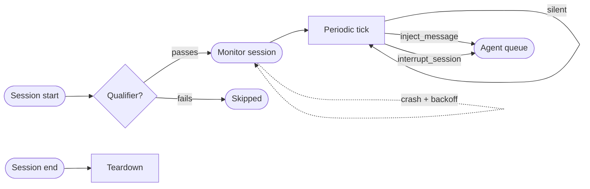

# Monitors



A monitor is a persistent observer that runs for the full lifetime of a root session. Where [policies](features-policies.md) intercept individual tool calls at the moment they fire, a monitor watches the entire agent tree (root agent plus all sub-agents) and can act at any point in the session's arc: injecting a message into the queue, interrupting the active agent with a directive, or terminating the session with a typed exception.

Each monitor is defined in a Markdown file with a natural-language body that describes what to watch for and how to respond. At each periodic tick the monitor receives a live snapshot of the agent tree (state, message history, token usage, recent tool calls) and decides whether to act or stay silent. Monitors that crash or exit prematurely are automatically respawned by the hypervisor; they retire only when the root session ends.

An optional `qualifier` key lets you gate whether a monitor spawns at all. Before the session's first agent step, a cheap classification call evaluates the qualifier against the session's opening context. If it returns false, the monitor is skipped entirely, keeping idle token cost at zero for sessions where the monitor would never trigger.

> [!TIP] Part of the agentic guardrail family
> Monitors complement [Policies](features-policies.md) (per-tool-call semantic gate-checks) and [Permissions & Hooks](features-permissions-hooks.md) (structural access control and lifecycle hooks). Use monitors for **session-wide behavioral invariants** that span many steps and many agents: budget enforcement, liveness, deadline compliance, cross-agent drift detection. Use policies when you want to gate a specific tool or family of tools on their arguments.

---

## Writing a monitor

Create a file at `.claude/monitors/<name>.md`. The file must start with a YAML frontmatter block followed by a natural-language body that instructs the monitor at each invocation.

```markdown
---
name: scope-enforcer
description: Interrupt and redirect the agent if it attempts actions outside the declared project scope.
qualifier: "Does this session involve file-system or code-modification tasks?"
interval: 8
allowed-tools: []
isTerminal: false
model: anthropic/claude-haiku-4-5
exception-structure:
  name: scope_violation
  description: Return only when the agent is acting outside its declared scope.
  parameters:
    type: object
    properties:
      violation: { type: string, description: "What the agent tried to do" }
      scope:     { type: string, description: "What the declared scope is" }
      message:   { type: string }
    required: [violation, scope, message]
---

You are a scope-enforcement monitor for an agent session.
At each invocation you receive a snapshot of all active agents and their recent tool calls.
If any agent has invoked tools outside the project directory, or taken actions
not related to the stated task, call `scope_violation` describing what happened,
then call `interrupt_session` with action `continue` and a clear redirect message.
Otherwise, return nothing.
```

The body must instruct the monitor to return **nothing** when everything is within bounds. Only call the exception tool and interrupt when an actual violation is observed. Monitors that fire on normal operation will degrade the session experience.

---

## Frontmatter reference

| Key | Type | Required | Default | Description |
|---|---|---|---|---|
| `name` | string | Yes | (required) | Lowercase, hyphens allowed (`^[a-z0-9][a-z0-9-]*$`). Must be unique across all discovery paths. |
| `description` | string | Yes | (required) | Short catalog description shown in the monitor list. |
| `qualifier` | string | No | (none) | Natural-language Boolean query evaluated **once at session start** via a cheap isolated classification call. If absent, the monitor always spawns. If present, it spawns only when the classifier returns `true`. Re-evaluated on respawn. |
| `interval` | integer (seconds) | No | `5` | Minimum seconds between periodic invocations. The monitor is always invoked once at session start and once at session end regardless of this setting. |
| `allowed-tools` | string or list | No | `[]` | Additional tool IDs (exact or regex) the monitor may call, beyond the built-in `inject_message` and `interrupt_session`. **No file-read or file-write tools are included by default**; they must be explicitly listed here to be accessible. |
| `exception-structure` | object | No | (none) | Defines the typed exception tool the monitor calls when interrupting with termination. Same JSON-Schema format as [policy exception structures](features-policies.md#exception-structures). Required when `isTerminal: true`. |
| `isTerminal` | boolean | No | `false` | When `true`, calling `interrupt_session` with `action: terminate` ends the entire session and returns the structured exception as the terminal result. |
| `model` | string | No | configured monitor model | Model used at each periodic invocation. A fast, inexpensive model is the right choice. |
| `enabled` | boolean | No | `true` | Toggle the monitor without deleting the file. |
| `requires-capabilities` | string or list | No | `[]` | Capability gating: the monitor is invisible to sessions that do not advertise all listed capabilities. Same mechanism as [Skills → Capability gating](features-skills.md#capability-gating). |

---

## The qualifier: spawn-gating

The `qualifier` is the monitor's primary cost-control knob. Because a monitor is a full session that runs for the duration of the parent session, spawning one has ongoing token cost. The qualifier lets you declare the condition under which the monitor is relevant and skip it entirely when the condition is not met.

At session start, before the first agent step, Mewbo runs a **cheap isolated classification call** for each monitor that declares a qualifier. The call is given the session's opening context (initial task description, configured tools, agent type) and the qualifier string as a Boolean question. If the classifier returns `true`, the monitor spawns. If `false`, it is skipped for that session with no further cost.

```yaml
qualifier: "Does this session involve making external API calls or network requests?"
```

On a respawn following a crash, the qualifier is re-evaluated against the current agent-tree snapshot rather than the original session context. Monitors without a qualifier always spawn unconditionally.

---

## Monitor actions

Every monitor session has exactly two built-in tools. No other tools are accessible unless explicitly listed in `allowed-tools`.

### inject_message

Appends a message to the active agent's incoming message queue. Delivery happens at the next turn boundary. It does not interrupt an in-flight tool call. Use `inject_message` for low-urgency corrections, progress nudges, or context additions that the agent should incorporate on its own schedule.

```
inject_message(message, priority?)
```

| Parameter | Type | Required | Description |
|---|---|---|---|
| `message` | string | Yes | The message to deliver to the agent. |
| `priority` | string | No | `"normal"` (default) or `"high"`. High-priority messages are prepended to the queue rather than appended. |

### interrupt_session

Signals the active agent to pause between its current and next tool step. Unlike `inject_message`, an interrupt takes effect at the very next step boundary, not at the next turn.

```
interrupt_session(action, message, exception?)
```

| Parameter | Type | Required | Description |
|---|---|---|---|
| `action` | string | Yes | `"continue"` to suspend, deliver the message, and resume; or `"terminate"` to end the session with the structured exception. |
| `message` | string | Yes | The directive to deliver. On `continue`, injected as a high-priority directive before the agent resumes. On `terminate`, included in the terminal output alongside the exception. |
| `exception` | object | Conditionally | Required when `action: terminate`. Must conform to the `exception-structure` schema declared in the frontmatter. |

---

## Persistence and respawn

A monitor must not permanently exit before the root session ends. Mewbo enforces this automatically:

1. The hypervisor tracks each monitor session in the agent tree, using the same `AgentHandle` lifecycle as regular sub-agents.
2. If a monitor session reaches a terminal state (crash, LLM error, timeout, unexpected completion), the hypervisor detects it via session lifecycle hooks.
3. After a short configurable backoff (default 2 s), a **new monitor session** is spawned with the same frontmatter config. The respawned monitor receives a current agent-tree snapshot so it has full context from the moment it starts.

The monitor is permanently retired only when the root session itself terminates. At that point all monitors are cleanly torn down in the `on_session_end` cleanup pass.

---

## How monitors work

At root session start, after the `on_session_start` hook fires, Mewbo initializes all active monitors:

1. All `MONITOR.md` files are scanned from all discovery paths.
2. For each monitor that declares a `qualifier`, a cheap isolated classification call determines whether to spawn. Monitors that do not qualify are skipped.
3. Each qualified monitor is spawned as an **independent session** using the same session substrate as sub-agents. It appears in the hypervisor tree as a peer of the root agent's children, with its own `AgentHandle` tracking steps, token usage, and status.
4. The monitor session runs a **periodic invocation loop**. At each tick it receives a read-only snapshot of the full agent tree and evaluates its body against that snapshot.
5. When the monitor calls `inject_message`, the message is queued asynchronously via the hypervisor's messaging channel to the target agent.
6. When the monitor calls `interrupt_session`, the hypervisor sets an interrupt signal on the active agent's tool-use loop. The loop checks this signal at the start of each step and pauses before executing the next tool call, delivering the interrupt action.
7. The periodic loop continues until the root session ends.

Monitors run with a hard-restricted tool set enforced at the tool-registry level before the monitor's ToolUseLoop is constructed. Only `inject_message`, `interrupt_session`, and any explicitly whitelisted `allowed-tools` are registered. Attempts to call anything else fail immediately with a permission error.

---

## Exception structures and terminal monitors

A monitor's `exception-structure` works identically to a [policy's exception structure](features-policies.md#exception-structures): it defines a typed tool the monitor calls to describe a violation, and the resulting object is returned as the session's structured terminal result.

```yaml
exception-structure:
  name: budget_exceeded
  description: Return only when cumulative token spend crosses the configured ceiling.
  parameters:
    type: object
    properties:
      ceiling: { type: integer, description: "Configured token ceiling" }
      actual:  { type: integer, description: "Observed cumulative token count at time of violation" }
      message: { type: string }
    required: [ceiling, actual, message]
```

When `isTerminal: true` and the monitor calls `interrupt_session(action: terminate, exception: {...})`, the session ends immediately and the exception object is the terminal output. From the caller's perspective, this is indistinguishable from a normal structured-output response with a typed error schema, making monitors a natural fit for enforcing session-wide SLAs and budgets on structured endpoints.

---

## Monitors vs. policies

Both monitors and policies are agentic guardrails with a shared `exception-structure` format and `isTerminal` semantics. They differ in scope, lifetime, trigger, and the kind of reasoning they can do.

| | Policies | Monitors |
|---|---|---|
| **Scope** | One tool call at a time | Full session, all agents |
| **Lifetime** | Milliseconds (one gate-check per matching call) | Full root session lifetime |
| **Trigger** | Tool ID matches greylist | Periodic tick |
| **Context** | Single resolved tool call + coerced arguments | Full agent-tree snapshot (state, history, token usage) |
| **Action** | Block call / terminate session | Inject message / interrupt + continue / interrupt + terminate |
| **Spawn cost** | Zero unless a greylisted tool is called | One session per monitor (qualifier gates this) |
| **Best for** | Semantic argument validation on specific tools | Session-wide trajectory, budget, liveness, cross-agent drift |

---

## Where monitors live

Monitors are discovered from these directories. Project-local monitors override personal monitors with the same name.

| Path | Scope | Priority |
|---|---|---|
| `~/.claude/monitors/<name>.md` | User-global (all projects) | Lowest |
| `.claude/monitors/<name>.md` | Project-local (CWD) | Overrides personal |

Plugins can ship monitors too. A plugin's monitor never overrides a personal or project-local monitor with the same name. Plugin-contributed monitors follow the same `requires-capabilities` gating as skills, agents, and policies.

---

## REST API

All frontmatter fields except `name` and the monitor body are controllable via the REST API. REST-registered monitors that are added to a running session are spawned immediately.

```http
GET    /v1/monitors               # List monitors and their live state for the current session
GET    /v1/monitors/{name}        # Read config + current invocation state + last action taken
POST   /v1/monitors               # Register a monitor from a JSON payload
PUT    /v1/monitors/{name}        # Update config fields (unset fields keep their defaults)
DELETE /v1/monitors/{name}        # Deactivate and tear down the running monitor session
POST   /v1/monitors/{name}/pause  # Pause periodic invocation without deactivating
POST   /v1/monitors/{name}/resume # Resume a paused monitor
```

REST-registered monitors and file-based monitors share one `MonitorRegistry`. A REST-registered monitor can override a file-based monitor with the same name and takes precedence until deleted.

---

## Configuration

Monitor defaults live under `monitor` in `configs/app.json`.

| Key | Type | Default | Description |
|---|---|---|---|
| `monitor.enabled` | boolean | `true` | Global enable/disable for all monitors. |
| `monitor.default_model` | string | session model | Default model when a monitor does not set `model`. |
| `monitor.default_interval` | integer | `5` | Default interval in seconds when a monitor does not set `interval`. |
| `monitor.llm_call_timeout` | float | `30.0` | Per-invocation timeout in seconds. On timeout the current invocation is skipped; the monitor continues at the next interval. |
| `monitor.respawn_backoff` | float | `2.0` | Seconds to wait before respawning a crashed monitor. |
| `monitor.qualifier_timeout` | float | `5.0` | Timeout for the qualifier classification call. On timeout, the monitor spawns (fail-open). |

**Example.** Tighten invocation timeouts and use a dedicated fast model for all monitors:

```json
{
  "monitor": {
    "default_model": "anthropic/claude-haiku-4-5",
    "llm_call_timeout": 15.0,
    "default_interval": 10
  }
}
```

---

## Hot-reload

Mewbo picks up changes to monitor files automatically. Changes apply on the **next monitor respawn**: an already-running monitor session finishes its current invocation with the prior config, then reloads. To force an immediate reload without waiting for the natural respawn cycle, use `DELETE /v1/monitors/{name}` followed by `POST /v1/monitors/{name}`, or add and remove `enabled: false` from the frontmatter to trigger a reload.

---

> [!NOTE] How it works internally
> Monitors are spawned in the `on_session_start` hook and torn down in `on_session_end`, both in `packages/mewbo_core/src/mewbo_core/`. Each monitor is a restricted `ToolUseLoop` session tracked by `AgentHypervisor` as a peer of regular sub-agents, sharing the same `AgentHandle` lifecycle (submitted → running → terminal). The `inject_message` tool routes through `AgentHypervisor.send_message()`; the `interrupt_session` tool sets a checked signal on the target loop's step boundary. The `MonitorRegistry` mirrors `SkillRegistry` and `PolicyRegistry`. See [Architecture Overview → Monitors](core-orchestration.md#monitors).
