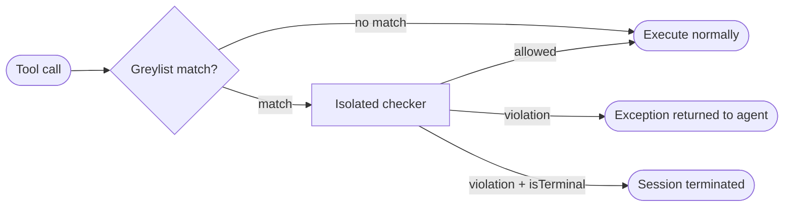

# Policies



A policy is a declarative, natural-language guardrail that intercepts tool calls before they execute. You describe what constitutes a violation in plain English; Mewbo runs a fast, isolated LLM check against that description every time a greylisted tool is about to fire. On a violation the call is blocked and a **structured exception** (whose schema you define in the policy frontmatter) is returned to the agent in place of the tool result, giving it a chance to reason about and recover from the block. Setting `isTerminal: true` escalates any violation to a session-ending event, returning the structured exception as the session's final output.

Policies work on the semantic layer above `allowed-tools` and `denied-tools`. Where those are binary lists, a policy can reason about the *content* of a call (amounts, targets, user intent, argument shape) and enforce arbitrary natural-language invariants against any tool from any MCP server.

> [!TIP] Part of the agentic guardrail family
> Policies complement [Plan Mode](features-plan-mode.md) (path-scoped edit gating) and [Permissions & Hooks](features-permissions-hooks.md) (structural allow/deny + shell lifecycle hooks). Use policies for **semantic** guardrails that require reasoning about tool arguments; use the others for structural access control. For session-wide behavioral invariants that span many steps and many agents, see [Monitors](features-monitors.md).

---

## Writing a policy

Create a file at `.claude/policies/<name>.md`. The file must start with a YAML frontmatter block followed by a natural-language body that instructs the isolated checker on what constitutes a violation.

```markdown
---
name: no-destructive-deletes
description: Block file or database deletion calls that target paths outside the project sandbox.
greylisted-tools:
  - delete_file
  - mcp__fs__.*
  - mcp__database__drop_.*
isTerminal: false
model: anthropic/claude-haiku-4-5
exception-structure:
  name: policy_violation
  description: Return ONLY when a deletion is out of sandbox. Return nothing if the call is allowed.
  parameters:
    type: object
    properties:
      code:
        type: string
        enum: [out_of_sandbox, destructive_db_drop]
      message:
        type: string
        description: Operator-facing reason the call was blocked.
      offending_tool:
        type: string
    required: [code, message, offending_tool]
---

Block any file-deletion tool call whose target path is not inside `/home/user/project/`.
Block any database tool call that would drop or truncate a table.
If the call is within policy, return nothing.
If it violates policy, call `policy_violation` with an appropriate `code` and a clear `message`.
```

The body must direct the checker to call the exception tool **only on a violation** and to return **nothing** on a clean call. Spurious exceptions that fire on allowed calls will block legitimate tool use.

---

## Frontmatter reference

| Key | Type | Required | Default | Description |
|---|---|---|---|---|
| `name` | string | Yes | (required) | Lowercase, hyphens allowed (`^[a-z0-9][a-z0-9-]*$`). Must be unique across all discovery paths. |
| `description` | string | Yes | (required) | Short catalog description used for REST-based discovery and the policy list. |
| `greylisted-tools` | string or list | Yes | (required) | Tool IDs that trigger this policy. Each entry may be an **exact tool ID** or a **regex** matched against the fully-resolved MCP tool name. Same ID namespace as `allowed-tools`. |
| `exception-structure` | object | Yes | (required) | Defines the structured-exception tool the isolated checker may call on violation: `name`, `description`, and a JSON-Schema `parameters` block. This is the only tool available to the checker. |
| `isTerminal` | boolean | No | `false` | When `true`, a violation **terminates the entire session** and returns the structured exception as the terminal result. When `false`, only the matching tool call is blocked and the exception is returned to the agent in-place. |
| `model` | string | No | configured policy model | Model for the isolated checker invocation. A fast, inexpensive model is the right choice. |
| `enabled` | boolean | No | `true` | Toggle the policy on or off without deleting the file. |
| `requires-capabilities` | string or list | No | `[]` | Capability gating: the policy is invisible to sessions that do not advertise all listed capabilities. Same mechanism as [Skills → Capability gating](features-skills.md#capability-gating). |

---

## Greylist matching

Each entry in `greylisted-tools` is matched against the **resolved tool ID**: the full namespaced identifier Mewbo uses after MCP resolution. Entries are treated as regexes; an exact tool name is a degenerate regex that matches only itself.

```yaml
greylisted-tools:
  - issue_refund              # exact match on a built-in tool
  - mcp__payments__.*         # all tools from the 'payments' MCP server
  - mcp__fs__(delete|unlink)  # two specific operations on the 'fs' server
```

Greylists are evaluated per tool call. Multiple policies may match the same call; all matching active policies run in parallel. A violation by any one blocks the call. A terminal violation by any one terminates the session.

---

## The gate-check: how a policy runs

Policies hook into the tool-use loop at the pre-execution gate: after MCP input coercion and permission checks, before the pre-tool hook fires and before the tool itself executes. When a resolved tool call matches an active policy's greylist:

1. The fully-resolved tool call (name + coerced arguments) is captured.
2. An **isolated LLM invocation** is started: a single-turn call with minimal context containing the policy body, the resolved tool call, and the exception-structure tool as the only callable tool. The checker cannot see the agent's conversation history.
3. The checker returns one of two things:
   - **Nothing:** the policy holds. The tool call proceeds normally.
   - **The exception-structure tool call:** policy violated. The original tool call is blocked. The structured exception is injected into the agent's message history as a tool error result, letting the agent reason about the block and correct course.
4. If `isTerminal: true` and a violation occurs, the session is ended immediately with the structured exception as its terminal output.

Isolation keeps gate-checks fast, cheap, and auditable. The checker has no access to the session's full context and cannot take actions of its own.

Multiple active policies that match the same call run concurrently. Terminal violations take precedence over non-terminal ones.

---

## Exception structures

The `exception-structure` key defines the typed tool that is given to the isolated checker and returned to the calling agent on a violation. It follows the same JSON-Schema tool-definition format used throughout Mewbo:

```yaml
exception-structure:
  name: refund_blocked
  description: Return only when a refund violates policy. Include the reason and the offending amount.
  parameters:
    type: object
    properties:
      code:
        type: string
        enum: [over_ceiling, no_matching_order, unauthorized_scope]
      message:
        type: string
      amount:
        type: number
    required: [code, message]
```

The exception object is returned to the agent verbatim in the tool result slot. Design `code` values to be machine-readable and stable across policy updates so agents can pattern-match on them reliably.

---

## Terminal violations

When `isTerminal: true`, a policy violation does not just block the call. It terminates the entire session. The structured exception becomes the session's final result, surfaced through the same terminal-result path as a structured-output response.

Terminal policies are most useful in front of **structured-output endpoints** ([/v1/structured](endpoint:POST /v1/structured)), where a request must either produce a valid structured response or fail cleanly with a typed exception. Referencing a policy by name in a structured request activates it for the duration of that call:

```http
POST /v1/structured
Content-Type: application/json

{
  "prompt": "Issue a refund for order #1234",
  "schema": { ... },
  "policies": ["no-refunds-over-policy"]
}
```

If the named policy fires, the endpoint returns the structured exception in the response body rather than the schema output. The caller always receives a typed, parseable result regardless of which path was taken.

---

## Where policies live

Policies are discovered from these directories. Project-local policies override personal policies with the same name.

| Path | Scope | Priority |
|---|---|---|
| `~/.claude/policies/<name>.md` | User-global (all projects) | Lowest |
| `.claude/policies/<name>.md` | Project-local (CWD) | Overrides personal |

Plugins can ship policies too. A plugin's policy never overrides a personal or project-local policy with the same name. Plugin-contributed policies follow the same `requires-capabilities` gating as skills and agents.

---

## REST API

All frontmatter fields except `name` and the policy body are controllable via the REST API, letting you activate, tune, or disable policies from code without touching policy files on disk.

```http
GET    /v1/policies               # List all active policies and their resolved config
GET    /v1/policies/{name}        # Read the resolved config for a specific policy
POST   /v1/policies               # Register a policy from a JSON payload
PUT    /v1/policies/{name}        # Update config fields (unset fields keep their defaults)
DELETE /v1/policies/{name}        # Remove a REST-registered policy
```

REST-registered policies and file-based policies share one registry and one greylist-matching pipeline. A REST override of a file-based policy takes precedence until deleted.

---

## Configuration

Policy-check defaults live under `policy` in `configs/app.json`.

| Key | Type | Default | Description |
|---|---|---|---|
| `policy.enabled` | boolean | `true` | Global enable/disable for all policy gate-checks. |
| `policy.default_model` | string | session model | Default checker model when a policy does not set `model`. |
| `policy.llm_call_timeout` | float | `15.0` | Per-check timeout in seconds. On timeout: fail-closed for `isTerminal: true` policies; fail-open for non-terminal ones. |
| `policy.cache_verdicts` | boolean | `true` | Cache identical (policy, tool, args) verdicts within a session to avoid redundant checker calls. |
| `policy.fail_open` | boolean | `false` | When `true`, checker errors on non-terminal policies resolve as "no violation" rather than blocking the call. Has no effect on terminal policies, which always fail-closed. |

**Example.** Tighten timeouts and disable verdict caching in an environment with frequently mutating tool arguments:

```json
{
  "policy": {
    "llm_call_timeout": 8.0,
    "cache_verdicts": false
  }
}
```

---

## Hot-reload

Mewbo notices when a policy file changes on disk and picks up the new version automatically. Changes apply to the next matching tool call; no restart is required. A gate-check that is already in flight when the file changes will finish with the prior version; the update takes effect on the call after.

---

> [!NOTE] How it works internally
> Policies hook into the pre-execution gate inside `ToolUseLoop._execute_tool_call()` in [packages/mewbo_core/src/mewbo_core/tool_use_loop.py](repo:packages/mewbo_core/src/mewbo_core/tool_use_loop.py), after MCP input coercion and the permission check but before `run_pre_tool_use`. The isolated checker is a minimal single-turn LiteLLM call (not a full ToolUseLoop session) bound to the exception-structure tool only. The `PolicyRegistry` mirrors `SkillRegistry` in `packages/mewbo_core/src/mewbo_core/`. See [Architecture Overview → Policies](core-orchestration.md#policies).
