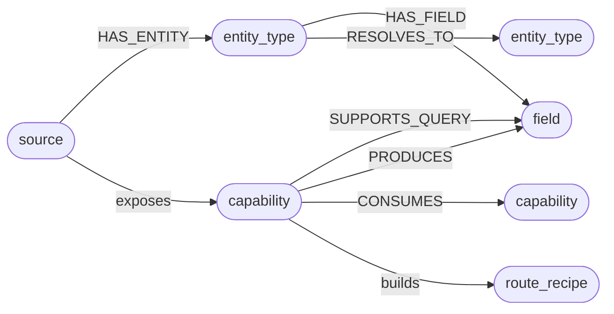

# Agentic Search

  

Ask a question in plain English and Mewbo searches across everything you've connected. A coordinating agent decomposes the question, routes each part to the right sources via the Source Capability Graph, fans out probe agents to execute the retrieval, and synthesises one ranked answer with citations and a full agent trace.

---

## Workspaces scope the search

A **workspace** is a named bundle of connected sources for one topic. *Engineering docs* might point at your repos, RFCs, and architecture pages; *Support intel* at customer tickets, Slack threads, and public issues; *Research library* at papers and reading lists. Each workspace shows the MCP sources wired into it, and every question runs against the workspace you pick. A query about a customer issue won't trawl your design system, and vice versa.

Spin up a new workspace whenever you have a new question domain: name it, choose which MCP servers it can reach, and start asking.

### Edit the purpose, re-index the graph

Every workspace card carries an edit (pencil) button. It opens the workspace's name, its source selection, and a **Purpose & instructions** field. That text is not decoration. It codifies what the workspace's graph is for, and it seeds the enrichment step that runs when sources are mapped. Save a meaningful change (the purpose text, the description, or the source selection) and Mewbo re-maps and re-enriches the workspace's mapped sources in the background; the console confirms with a re-index toast. A name-only edit changes nothing in the graph and stays quiet.

### See what a workspace knows

Each card also has a graph button. It opens the workspace's capability graph in a dialog, served by [GET /api/agentic_search/workspaces/{workspace_id}/graph](endpoint:GET /api/agentic_search/workspaces/{workspace_id}/graph). The view is layered, with a toggle per layer:

- **Schema**: capability, entity-type, and field nodes from the workspace's mapped sources.
- **Memory**: the learned connector notes deposited by past runs.
- **Entity**: abstract concepts resolved across sources.

Sources you enabled but have not yet mapped appear as ghost nodes with a hint to map them, so a half-configured workspace is visible at a glance instead of silently smaller.

  

---

## One question, parallel probe agents

  

A single `scg-search` agent handles the full query lifecycle. It decomposes the question into sub-queries, calls `scg_route` to find the highest-ranked pathways through the Source Capability Graph, and spawns a bounded set of probe agents (each scoped to one pathway) to execute the actual retrieval in parallel. Because it runs on the same hypervisor as every other Mewbo task, the fan-out is observable, steerable, and bounded. A typical query resolves in seconds.

---

## How the Source Capability Graph works

The **Source Capability Graph (SCG)** is a reachability index: a graph of what each connected source *can answer*, built from its schemas and tool definitions. No credentials or record values enter the graph. It exists solely to route queries to the right capabilities before any data is fetched.

### What the graph contains

The SCG has five node types and six edge types.

**Nodes:**

| Node | What it represents |
|---|---|
| `source` | A connected MCP server or API |
| `entity_type` | A schema type the source exposes (Jira Issue, Linear Ticket, database table) |
| `field` | An individual property on an entity type |
| `capability` | An executable operation: an MCP tool, an OpenAPI endpoint, a database procedure |
| `route_recipe` | A precomputed, ordered pathway through one or more capabilities that can answer a class of question |

**Edges:**

| Edge | Meaning |
|---|---|
| `HAS_ENTITY` | Source exposes this schema type |
| `HAS_FIELD` | Entity type has this field |
| `SUPPORTS_QUERY` | Capability accepts this field as input |
| `PRODUCES` | Capability returns this field in its output |
| `CONSUMES` | Capability chains into another (producer output matches consumer input) |
| `RESOLVES_TO` | Two entity types from different sources describe the same concept |

Node identities are content-addressed: `sha1(source_key | node_kind)[:16]`. Re-indexing a source produces stable, idempotent IDs.

### How a source is indexed

Adding a source triggers a five-phase map pipeline:

1. **Connect**: resolve and authenticate the connector descriptor
2. **Introspect**: fetch the raw schema: OpenAPI document, MCP tool list, or SQL introspection
3. **Parse**: dispatch to the provider to emit capability nodes, entity-type nodes, field nodes, and their edges. An OpenAPI source produces one capability node per `operationId`; an MCP tool list produces one capability node per tool.
4. **Link**: run [TypeAligner](repo:packages/mewbo_graph/src/mewbo_graph/scg/entity_resolution.py) across all sources to emit weighted `RESOLVES_TO` edges where schema types correspond (see [Cross-source type alignment](#cross-source-type-alignment) below)
5. **Finalize**: embed every node with the same LiteLLM-backed embedding model used by the Agentic Wiki; compute `CONSUMES` edges by matching capability output field names to input field names across sources

The embedding step is best-effort. If no embedding backend is configured the SCG routes queries on graph structure alone.

### How queries are routed

Query routing is a **zero-LLM operation** inside `scg_route`:

1. Embed the query with the same model used at index time
2. Run a brute-force cosine ANN over all stored capability and entity-type embeddings
3. Expand one hop along all edge types in both directions (outbound + one-hop reverse lookup)
4. Score each candidate: `cosine_similarity(query, node) + edge_weight`
5. Return the top-k ranked `RouteRecipe` objects, each an ordered sequence of source steps

Each RouteRecipe becomes the brief for one probe agent. The probe is granted only the tools listed in its recipe, so it cannot wander to unrelated sources. The coordinating agent collects all probe results via `check_agents`, then synthesises them into one cited answer.

> [!NOTE] Scale path
> The current brute-force cosine pass is designed with a documented upgrade seam to Personalised PageRank at scale. The calling interface does not change; only the ranking kernel is swapped in.

### Reading the graph directly: `scg_observe`

`scg_route` ranks entry points. `scg_observe` lets the agent walk from them. Given one or more node references, it returns each node's typed neighbourhood: its edges with kind, direction, and weight, compact neighbour cards, the route recipes that pass through it, and any learned memory notes anchored to it. The typed edges (`SUPPORTS_QUERY`, `PRODUCES`, `CONSUMES`, `RESOLVES_TO`) carry the routing meaning, so deciding where to step next is the agent's own reasoning, not a second ranking engine.

Large nodes answer in two stages. An unfiltered read of a high-degree node returns a survey first: the distinct edge and neighbour kinds with counts. The agent then re-calls with an `edge_kinds` filter for the instances it actually wants. Observation is read-only and scope-filtered. A workspace-bound agent never observes a hop into a source the workspace did not enable, and because it can't change anything, several nodes can be observed in parallel.

### Cross-source type alignment

At map time, `TypeAligner` compares entity-type nodes across sources and emits weighted `RESOLVES_TO` edges. Alignment is heuristic-first, LLM-assisted only in the ambiguous band:

| Field-name Jaccard overlap | Behaviour |
|---|---|
| ≥ 0.6 (confident) | Edge emitted on heuristic alone |
| 0.15–0.6 (ambiguous) | One LLM call adjudicates; edge emitted only on affirmation |
| < 0.15 | Abstain; no edge emitted |

The Jaccard score compares field names between two entity types. An exact name match between the two entity types adds a +0.2 bonus on top. `RESOLVES_TO` edges are weighted hypotheses, not hard joins. The router uses them to widen the probe scope across sources that describe the same concept. The correspondence is probabilistic, not a hard join.

This is what lets a query about task ownership route to both Jira and Linear without any manual configuration, because their `assignee` fields overlap above the confidence threshold.

### Entity resolution across sources

[TypeAligner](repo:packages/mewbo_graph/src/mewbo_graph/scg/entity_resolution.py) establishes probabilistic schema correspondences at map time. At query time, a second, deeper resolution step runs: [ScgAnchorResolver](repo:packages/mewbo_graph/src/mewbo_graph/scg/memory_bridge.py) implements the wiki's [StructureProvider](repo:packages/mewbo_graph/src/mewbo_graph/wiki/structure_provider.py) protocol, making every capability node and entity-type node in the SCG a participant in the same [ResolutionLadder](repo:packages/mewbo_graph/src/mewbo_graph/entities/resolver.py) used by the Agentic Wiki to resolve code symbols into named concepts.

In practice this means three things for your consumers:

- A search over "who is responsible for the billing service" does not pattern-match on the string "responsible." It resolves through the entity layer to the abstract `owner` concept, which may surface as `assignee`, `maintainer`, `responsible_team`, or `owner` depending on the source. Entity resolution finds all of them.
- "Jira Issue" and "Linear Ticket" are not just similar by field-name overlap. Once `TypeAligner` emits a `RESOLVES_TO` edge and the entity layer anchors both to the same abstract concept, queries that touch either source automatically reach both, without the probe having to enumerate individual field names.
- Route recipes are assembled from resolved entity concepts, not raw schema fields. A recipe for "find open issues assigned to a user" works across any tracker connected to the workspace, not just the one it was built from.

### The shared multiplex graph

The SCG does not operate as an isolated reachability index. It is a tenant of the same three-layer multiplex graph that powers the Agentic Wiki, each layer holding different knowledge, all stored in one place and queryable together.

| Layer | What search stores here | What the wiki stores here |
|---|---|---|
| **Schema** | Capability nodes, entity-type nodes, and field nodes for all connected sources | AST symbols, imports, and call graphs from indexed codebases |
| **Entity** | Abstract concepts resolved across sources via `ScgAnchorResolver` | Named entities extracted by GraphRAG enrichment (services, modules, owners) |
| **Memory** | Reachability facts deposited after each search run, anchored to capability and entity-type nodes | Q&A findings deposited by `QaMemoryDepositor`, anchored to code symbols |

When a project is both wiki-indexed and part of a search workspace, the memory layers share the same store. A Q&A session that discovers "the `orders` module owns all purchase state" can surface during a search about purchase flows. A search run that discovers "the `catalog-api` server only returns published items by default" can inform a subsequent wiki answer about catalog data. The layers cross-pollinate without any explicit wiring.

Before each query, the top-k relevant memory notes are retrieved via vector search and surfaced to `scg_route`, biasing routing toward pathways that have produced results and away from dead ends already discovered. The memory layer grows with use. No manual curation is required.

---

## The graph follows you into ordinary chat

The SCG is not search-only. Once `scg.enabled` is on and at least one source is mapped, every ordinary Mewbo session (CLI, console chat, channels) gets three graph tools: `scg_route`, `scg_observe`, and `scg_memory`. There is nothing extra to configure. Mapping the first source flips a live process; no restart is needed.

The intended loop is **route, observe, act, deposit**. The agent routes to find entry pathways, observes the typed hops around them, acts with the connector tools it already has, then deposits what it learned through `scg_memory` so the next task starts ahead. Each deposit carries a polarity: `positive` boosts that pathway in future routing, `dead_end` damps it.

Scope differs by session kind. A workspace-bound search run reads only its workspace's sources. A plain chat session is unscoped and reads the whole graph. Deposits are attributed accordingly: workspace runs label theirs `ws:<id>`, plain sessions label theirs `session:<id>`, and both feed the same shared memory layer every future run draws on.

---

## Search tiers

Every search runs at one of three tiers, selectable per query. The tier is the run's single knob. It sets the decomposition budget, the probe fan-out, and the model the run thinks with.

| Tier | Sub-query decomposition | Probe fan-out | Default model | Best for |
|---|---|---|---|---|
| **Fast** | 1 | 2 | `openai/gpt-oss-120b` | Quick lookups; known-answer retrieval |
| **Auto** (default) | 2–3 | 3 | `openai/gpt-oss-120b` | General multi-source questions |
| **Deep** | 3–5 | 5 | `openai/gpt-oss-120b` | Exhaustive research; cross-source synthesis |

The model mapping lives at `scg.traversal.tier_models` (keys `fast`, `auto`, `deep`) and is editable in Settings like any other config key. Probe agents inherit the session model, so one tier choice moves the whole run, coordinator and probes alike. A blank mapping or an unrecognised tier falls back to `llm.default_model`, never an error. Where a request offers an explicit `model` override, it wins over the tier map.

Tiers add no verification rounds and no consensus voting. Each probe agent queries its connector directly and returns what it finds. Connector returns are ground truth: if a pathway returns data, the answer is grounded in it; if it returns nothing, the pathway is marked as a miss in the trace.

---

## A synthesised answer, with receipts

The top of every result is a **Synthesis** card: a direct, written answer to your question rather than ten blue links. It carries:

- **Inline citations**: each claim links to the source result it came from.
- **A confidence score**: reflects how many independent pathways returned corroborating evidence, weighted by the relevance scores returned by each probe.
- **Ask a follow-up**: keep pulling the thread without re-scoping; the workspace and context carry over.

Below it, the underlying **results** are listed in rank order (a merged PR, a Slack thread, a tracker issue), each with its source, status, and a snippet. Filter the list by type with one click: **Docs**, **Code**, **Threads**, **Design**, **Tickets**, or **Web**.

> [!TIP]
> When a wiki-indexed project is part of the workspace, search and wiki share the same multiplex graph. Search results that touch that codebase automatically draw on the wiki's entity and memory layers, surfacing what a module does, how subsystems relate, and what past Q&A sessions have established, alongside the raw connector results. No extra setup is needed.

---

## See how it got there

Agentic Search is transparent by design. Alongside each answer:

  

- **Agent trace**: which sources were queried and which returned a hit, so you can see the search actually ran end to end.
- **Related questions**: the obvious next questions, one click away.
- **People**: who authored, merged, or reported the artefacts behind the answer, pulled straight from the sources.

### Share a run with a link

Every run has a stable, shareable URL: `/search?ws=<workspace>&run=<run>`. Opening it loads the saved run directly: the synthesis, results, and trace render from a single durable snapshot, then live updates attach if the run is still in flight. The link is deterministic and multi-user: it resolves the same run for anyone with access, survives a server restart, and re-opens to the exact answer (linked to its underlying session for auditing). A link to a run that no longer exists returns a clean "not found" rather than an error page.

---

## Programmatic access via MCP

Agentic Search is accessible through the [MCP server](clients-mcp.md), so external agents and automated pipelines can run searches without the console:

| Tool | What it does |
|---|---|
| `list_search_workspaces` | List your saved workspaces. Returns each workspace's id, name, and connected sources. Pass an optional query string to filter by name, description, or past-query text. |
| `search` | Run a query against a workspace and receive a cited answer. Pass the workspace id or name; optionally scope to a specific project. |
| `get_search_run` | Fetch the result of a prior search run. Useful for long-running searches or replaying past results. |

Results come back at two detail tiers: **`answer`** (synthesis plus a compact result index, the default) and **`full`** (adds per-result snippets and entity insights).

> [!TIP]
> When you need the answer in a validated JSON structure rather than prose, the [Structured Outputs](features-structured-outputs.md) endpoint runs an agentic session grounded in a search workspace and emits a machine-readable object matching your schema. Useful for automated pipelines.

---

## Availability

Agentic Search lives in the **Mewbo Console**, reachable from the top navigation next to Tasks and Wiki. It reads the MCP servers you've already configured (the same connections used everywhere else in Mewbo) and groups them into workspaces.

### Enabling search

Orchestrated search ships disabled. To turn it on:

1. Enable the **SCG** switch in Settings (the `scg.enabled` key).
2. Open **Sources** on the Search landing page and **map** each source you want searchable. Mapping introspects the source's schema and builds its capability subgraph. Progress streams live and survives a page reload.
3. Pick a **tier** (Fast / Auto / Deep) next to the search bar; the default comes from `scg.traversal.default_tier`.

Until search is enabled and at least one source is mapped, queries run against bundled demo fixtures so you can explore the surface. The switch to real orchestrated runs takes effect on the next query, no restart required.

> [!NOTE] Going deeper
> Search reuses the same primitives as the rest of the engine. See [External Tools (MCP)](features-mcp.md) for how connected sources are configured, and [Sub-agents](features-agents.md) for the parallel fan-out and the hypervisor that bounds it.
