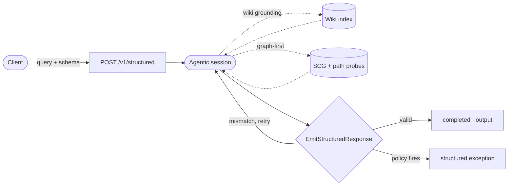

# Structured Outputs



Structured Outputs lets you run an agentic Mewbo session constrained to a JSON Schema you provide. Instead of a free-form answer, the session must emit a validated object matching your schema. This makes it the right choice for automated pipelines, agent-to-agent communication, and anywhere you need machine-readable output rather than prose.

Two endpoints plus a mode cover the latency spectrum. Pick by how much work the answer needs:

| Endpoint / mode | What you get | Profile |
|---|---|---|
| [POST /v1/structured](endpoint:POST /v1/structured) (default) | The full agentic run: tools, grounding, sub-agent probes, schema-validated output. | Async run handle. Seconds to minutes. |
| [POST /v1/structured](endpoint:POST /v1/structured) with `"mode": "synthesis"` | Retrieval-only synthesis: no tool use, one model round trip, schema-validated output plus citations. Returns inline. | Synchronous. Tuned for fast first tokens. |
| [POST /v1/draft/stream](endpoint:POST /v1/draft/stream) | A free-text draft answer streamed token by token over SSE. No schema. | Lowest latency. Tool-light by design. |

All three are session-backed. Every run leaves an auditable transcript and a Langfuse trace, keyed by a `session_id` you get back on the wire.

---

## How it works

POST a query and a JSON Schema to [/v1/structured](endpoint:POST /v1/structured). Mewbo starts an agentic session internally. The session can call grounding tools, search connected sources, and use its knowledge to assemble the answer. When it's ready, the session calls an [EmitStructuredResponse](repo:packages/mewbo_core/src/mewbo_core/structured_response.py#L137) tool that validates the payload against your schema. If the object doesn't match, the model is asked to fix it through the normal tool-result loop. No special control mechanism is needed.

The POST returns a run handle right away. Runs that finish within a few seconds come back inline with `status: "completed"` and the output attached. For everything else, poll [GET /v1/structured/{run_id}](endpoint:GET /v1/structured/{run_id}), or attach to the live event stream (see below).

**Request fields**

| Field | Required | Description |
|---|---|---|
| `query` | yes | The natural-language request. |
| `schema` | yes | JSON Schema the output object must validate against. |
| `workspace` | no | A wiki slug, or an Agentic Search workspace id or name. Enables grounding. |
| `tools` | no | Tool allowlist. Narrows what the run may call; it never widens the grant. |
| `model` | no | Any configured LiteLLM model id (for example `openai/gpt-5.4-nano`). Omit to use the configured default. |

**Extract all public API endpoints from a codebase**

Send a [POST /v1/structured](endpoint:POST /v1/structured):

```json
{
  "query": "List every public REST endpoint this project exposes, with its HTTP method and request body schema.",
  "schema": {
    "type": "object",
    "properties": {
      "endpoints": {
        "type": "array",
        "items": {
          "type": "object",
          "properties": {
            "path":   { "type": "string" },
            "method": { "type": "string", "enum": ["GET", "POST", "PUT", "PATCH", "DELETE"] },
            "body_schema": { "type": "object" }
          },
          "required": ["path", "method"]
        }
      }
    },
    "required": ["endpoints"]
  },
  "workspace": "my-api-codebase"
}
```

The response comes back immediately with a run handle:

```json
{
  "run_id": "1f3a9c0db64e:r1",
  "status": "running",
  "workspace": "my-api-codebase"
}
```

Poll [GET /v1/structured/{run_id}](endpoint:GET /v1/structured/{run_id}) until `status` is `completed`, then read `output`:

```json
{
  "run_id": "1f3a9c0db64e:r1",
  "status": "completed",
  "output": {
    "endpoints": [
      { "path": "/v1/users", "method": "GET" },
      { "path": "/v1/users", "method": "POST", "body_schema": { "type": "object" } }
    ]
  }
}
```

Failures always come back as a structured envelope, `{"error": {"code": ..., "reason": ...}}`, never a raw exception. An unknown run id is a clean 404 with the same envelope.

### Watching a run live

You don't have to poll. The run handle is `<session_id>:r<seq>`, so everything before the first colon is the id of the backing session. Attach to [GET /api/sessions/{session_id}/stream](endpoint:GET /api/sessions/{session_id}/stream) and the session's events arrive over SSE as they happen: tool calls, sub-agent probe fan-out, and the final output. The stream is push-based, not a poll loop, so events land the moment they are appended. Polling [GET /v1/structured/{run_id}](endpoint:GET /v1/structured/{run_id}) stays available for callers that prefer it.

---

## Workspace grounding

Pass `workspace` and the session is grounded in your data, not the model's general knowledge. You get the same provenance guarantees as [Agentic Search](features-search.md), packaged into a typed, schema-validated result. The value you pass picks the grounding mode.

**Wiki grounding.** A wiki slug grounds the run in that project's indexed sources through the default retrieval path. This is the baseline grounded run.

**Graph-first grounding.** An [Agentic Search](features-search.md) workspace whose sources are mapped into the Source Capability Graph routes the run graph-first. It is still one ordinary agentic session, but it is granted the workspace-scoped graph: routing tools plus the workspace's connector tools. The session consults the graph before anything else. `scg_route` proposes qualified pathways, scoped to the workspace's own sources only. The session then fans out one `scg-path-probe` sub-agent per promising pathway, aggregates what the probes bring back, and emits the schema-validated object.

Graph-first runs record their audit trail. [GET /v1/structured/{run_id}](endpoint:GET /v1/structured/{run_id}) carries an additive `provenance` block alongside the output:

```json
"provenance": {
  "recipes_routed": 2,
  "probes_run": 3,
  "probe_status": { "a1b2c3": "completed", "d4e5f6": "completed", "g7h8i9": "completed" }
}
```

It tells the story "graph consulted, probes executed, object emitted". Runs that fan out no probes simply omit the block, so the wire shape only carries provenance when there is something to carry.

Eligibility is automatic. Graph-first requires the SCG feature on (`scg.enabled`) and at least one of the workspace's sources mapped. Anything else, a wiki slug, an unmapped workspace, SCG off, or any resolution failure, falls back silently to the default grounded path. The wire shape is identical either way.

> [!TIP] What makes an answer grounded
> Workspace grounding means the agent traverses your indexed sources before writing a single token of the output object. Graph-first runs go further: the pathway and probe provenance in the result shows exactly which routes through your sources produced the answer.

---

## Fast synthesis mode: `POST /v1/structured` (`mode: "synthesis"`)

When you want a schema-validated object in one round trip, add `"mode": "synthesis"` to the request body. The synthesis path skips the agent loop entirely. No tools are bound. The server fetches grounding citations for your query, issues a single model call with the emit tool, and validates the result against your schema. One validation failure triggers one reask; a second failure returns a 422 with the structured error envelope. The response is returned inline — no polling required.

Request body: `query` (required), `schema` (required), `mode: "synthesis"` (required to select this path), `workspace` (an optional wiki slug for grounding), and `model` (an optional LiteLLM model id override).

```json
{
  "query": "List every public REST endpoint this project exposes.",
  "schema": { "type": "object", "properties": { "endpoints": { "type": "array", "items": { "type": "object" } } }, "required": ["endpoints"] },
  "workspace": "my-api-codebase",
  "mode": "synthesis"
}
```

The response arrives inline, without polling:

```json
{
  "run_id": "9e2d47c1c0a94d3b8f6a5e1b2c3d4e5f:r1",
  "status": "completed",
  "output": { "endpoints": [ { "path": "/v1/users", "method": "GET" } ] },
  "citations": [
    { "id": "p_142", "kind": "page", "snippet": "...", "score": 0.83, "source": "api/routes.md" }
  ],
  "workspace": "my-api-codebase"
}
```

`output` validates the schema you provided. `citations` lists the grounding sources used. The `run_id` handle (`<session_id>:r1`) still resolves via [GET /v1/structured/{run_id}](endpoint:GET /v1/structured/{run_id}) if you need to re-fetch it.

Each synthesis run mints a real session. The `run_id` prefix keys the run's transcript and its Langfuse trace, so a synthesis run is just as auditable as a full agentic one. Persistence is write-behind: the transcript is stored after the response is sent, so session backing adds nothing to the latency path.

---

## Draft streaming: `/v1/draft/stream`

Sometimes you don't need a schema. You need a readable draft on screen as fast as possible. [POST /v1/draft/stream](endpoint:POST /v1/draft/stream) streams a free-text answer token by token over Server-Sent Events. It is tool-light by design: one streaming model call, no tool use, no agent loop. Pass a `workspace` wiki slug and the server retrieves grounding context once, before streaming begins.

Request body: `query` (required), `workspace` (an optional wiki slug for grounding), and `model` (an optional LiteLLM model id override).

The response is `text/event-stream`. Each token arrives as its own frame, and a terminal frame closes the stream:

```
data: {"token": "The"}

data: {"token": " project"}

data: {"token": " exposes"}

data: {"done": true, "session_id": "9e2d47c1c0a94d3b8f6a5e1b2c3d4e5f"}
```

If the stream fails mid-flight you get an honest error frame instead of the done frame:

```
data: {"error": "<reason>"}
```

Drafts are session-backed too. The `session_id` rides the terminal `done` frame, and it is also sent up front in the `X-Mewbo-Session` response header before the first token. The header is exposed for cross-origin reads, so browser clients can grab it immediately; pure SSE consumers can wait for the done frame instead. The full transcript persists write-behind after the last token, and a stream that died mid-flight is recorded as `failed`, never as a false `completed`.

---

## Policy integration

Named [Policies](features-policies.md) can be activated per-request via the `policies` field:

```json
{
  "query": "...",
  "schema": { "..." },
  "policies": ["no-external-data-exfil"]
}
```

If a policy fires, the endpoint returns the structured exception in the response body instead of the schema output. The caller always receives a typed, parseable result regardless of which path was taken. This is a clean contract for quality-gated workflows.

> [!NOTE] Terminal policies and structured outputs
> A policy with `isTerminal: true` will end the session immediately on a violation and surface the structured exception as the run's final output. See [Policies](features-policies.md#terminal-violations) for details.

---

## Run lifecycle

| Status | Meaning |
|---|---|
| `running` | The agentic session is in progress. Keep polling, or attach to the session stream. |
| `completed` | The session emitted a valid object; `output` contains it. |
| `failed` | The session ended without emitting a valid object. |
| `canceled` | The run was canceled before it completed. |

A run that reaches a terminal state without a valid object answers [GET /v1/structured/{run_id}](endpoint:GET /v1/structured/{run_id}) with a 422 and the structured error envelope. Output present always reports `completed`; the emit tool only fires on success, so a payload is proof of completion.

---

## REST reference

```
POST   /v1/structured                    Run a schema-constrained agentic query (async, returns run_id)
POST   /v1/structured  {mode:synthesis}  Retrieval-only synthesis, one round trip (inline response)
GET    /v1/structured/{run_id}           Fetch run status, output, and graph-first provenance
POST   /v1/draft/stream                  Token-streaming draft answer over SSE
GET    /api/sessions/{session_id}/stream Live SSE feed of a run's backing session
```

Full parameters, response shapes, and ready-to-run request samples for every endpoint live in the [REST API Reference](rest-api.md).

---

## MCP tools

Two tools on the [MCP Server](clients-mcp.md) expose this endpoint to agents on your fleet:

| Tool | Purpose |
|---|---|
| `structured_query(query, schema, workspace?, tool_ids?)` | Start a structured run. Returns a `run_id` immediately. |
| `get_structured_run(run_id)` | Fetch the current status and result of a run. Re-engage after a timeout. |

`structured_query` posts to the same [/v1/structured](endpoint:POST /v1/structured) endpoint, so workspace grounding and graph-first routing apply to MCP callers unchanged.

See [MCP Server](clients-mcp.md) for authentication and setup.

---

## Enabling it

Structured Outputs is part of `mewbo-api`. Full workspace grounding requires the wiki extras:

```bash
uv sync --extra wiki
uv run mewbo-api
```

Without the extras the endpoint still works for schema-constrained sessions. Workspace grounding is silently skipped when the extra is absent. Graph-first grounding additionally needs the Source Capability Graph: enable `scg.enabled` and map at least one of the workspace's sources. See [Agentic Search](features-search.md).

> [!NOTE] Going deeper
> Structured runs are ordinary agentic sessions under the hood. They use the same [ToolUseLoop](repo:packages/mewbo_core/src/mewbo_core/tool_use_loop.py) and [Sub-agent](features-agents.md) model. The schema constraint and `EmitStructuredResponse` tool are layered on top, not a separate execution path. The graph-first discipline is the same story: a capability grant plus a playbook on the same loop, not a second engine.
