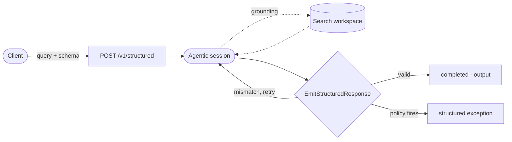

# Structured Outputs



Structured Outputs lets you run an agentic Mewbo session constrained to a JSON Schema you provide. Instead of a free-form answer, the session must emit a validated object matching your schema. This makes it the right choice for automated pipelines, agent-to-agent communication, and anywhere you need machine-readable output rather than prose.

---

## How it works

POST a query and a JSON Schema to `/v1/structured`. Mewbo starts an agentic session internally. The session can call grounding tools, search connected sources, and use its knowledge to assemble the answer. When it's ready, the session calls an `EmitStructuredResponse` tool that validates the payload against your schema. If the object doesn't match, the model is asked to fix it through the normal tool-result loop. No special control mechanism is needed. The endpoint responds asynchronously; poll `GET /v1/structured/{run_id}` for the result.

**Extract all public API endpoints from a codebase**

Send a `POST` to `/v1/structured`:

```json
{
  "query": "List every public REST endpoint this project exposes, with its HTTP method and request body schema.",
  "schema": {
    "type": "object",
    "properties": {
      "endpoints": {
        "type": "array",
        "items": {
          "type": "object",
          "properties": {
            "path":   { "type": "string" },
            "method": { "type": "string", "enum": ["GET", "POST", "PUT", "PATCH", "DELETE"] },
            "body_schema": { "type": "object" }
          },
          "required": ["path", "method"]
        }
      }
    },
    "required": ["endpoints"]
  },
  "workspace": "my-api-codebase"
}
```

The response comes back immediately with a run handle:

```json
{
  "run_id": "r_01abc",
  "status": "running"
}
```

Poll `GET /v1/structured/{run_id}` until `status` is `completed`, then read `output`:

```json
{
  "run_id": "r_01abc",
  "status": "completed",
  "output": {
    "endpoints": [
      { "path": "/v1/users", "method": "GET" },
      { "path": "/v1/users", "method": "POST", "body_schema": { "type": "object" } }
    ]
  }
}
```

---

## Workspace grounding

Pass `workspace: "workspace-name"` and the session is grounded in an [Agentic Search](features-search.md) workspace. It searches across your connected sources to build the answer. This is the key difference from a plain LLM call: the output is backed by your actual data, not the model's general knowledge.

> [!TIP] What makes an answer grounded
> Workspace grounding means the agent traverses your indexed sources before writing a single token of the output object. You get the same provenance guarantees as [Agentic Search](features-search.md), packaged into a typed, schema-validated result.

---

## Policy integration

Named [Policies](features-policies.md) can be activated per-request via the `policies` field:

```json
{
  "query": "...",
  "schema": { "..." },
  "policies": ["no-external-data-exfil"]
}
```

If a policy fires, the endpoint returns the structured exception in the response body instead of the schema output. The caller always receives a typed, parseable result regardless of which path was taken. This is a clean contract for quality-gated workflows.

> [!NOTE] Terminal policies and structured outputs
> A policy with `isTerminal: true` will end the session immediately on a violation and surface the structured exception as the run's final output. See [Policies](features-policies.md#terminal-violations) for details.

---

## Run lifecycle

| Status | Meaning |
|---|---|
| `running` | The agentic session is in progress. |
| `completed` | The session emitted a valid object; `output` contains it. |
| `failed` | The session ended without emitting a valid object; `error` contains the reason. |
| `cancelled` | The run was cancelled before it completed. |

---

## REST reference

```
POST   /v1/structured              Run a structured query (async, returns run_id)
GET    /v1/structured/{run_id}     Fetch run status and result
```

`/v1/structured/fast` is a streaming variant that emits partial tokens as the answer is assembled, useful when you want to display progress before the final object is validated.

---

## MCP tools

Two tools on the [MCP Server](clients-mcp.md) expose this endpoint to agents on your fleet:

| Tool | Purpose |
|---|---|
| `structured_query(query, schema, workspace?, tool_ids?)` | Start a structured run. Returns a `run_id` immediately. |
| `get_structured_run(run_id)` | Fetch the current status and result of a run. Re-engage after a timeout. |

See [MCP Server](clients-mcp.md) for authentication and setup.

---

## Enabling it

Structured Outputs is part of `mewbo-api`. Full workspace grounding requires the wiki extras:

```bash
uv sync --extra wiki
uv run mewbo-api
```

Without the extras the endpoint still works for schema-constrained sessions. Workspace grounding is silently skipped when the extra is absent.

> [!NOTE] Going deeper
> Structured runs are ordinary agentic sessions under the hood. They use the same `ToolUseLoop` and [Sub-agent](features-agents.md) model. The schema constraint and `EmitStructuredResponse` tool are layered on top, not a separate execution path.
