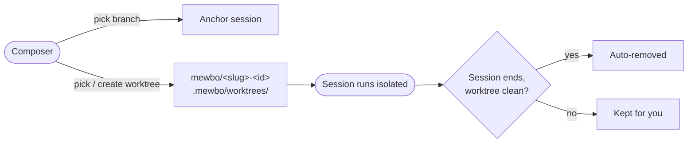

# Branches & Worktrees



Every session runs somewhere. By default that is the project's working directory. Branches & Worktrees lets you choose: anchor a session to a specific branch, or give it an isolated git worktree of its own. Isolation means you can run several sessions against the same repository at once, let an agent experiment freely, and throw the result away if it does not work out.

---

## Why isolation matters

Two sessions editing the same checkout will trip over each other. One agent's half-finished refactor becomes the other agent's mysterious build failure. A worktree solves this. It is a separate directory backed by the same repository, with its own branch checked out. Each session gets a private sandbox. The parent checkout stays untouched. When the work is good, you push the branch. When it is not, the worktree disappears and nothing leaks back.

---

## Using it from the console

Open the session composer's config menu. When the active project is a git repository, two extra tabs appear: **Branch** and **Worktree**.

- **Branch** lists the repository's branches with the current HEAD marked. Picking a branch records it on the session's context. It shows up on the session row and as a filterable facet on the session's traces. If the branch already has a managed worktree, the console locks onto that worktree so the session runs in its directory.
- **Worktree** lets you pick an existing worktree or create a new one. Picking one anchors the session to that directory. The session's `repo` and `branch` are derived automatically from the worktree.

The **Projects** page offers the same management surface: each project card carries a worktrees panel for creating, refreshing, and deleting worktrees outside the composer.

> [!TIP] Branch anchor vs. worktree anchor
> Picking a branch labels the session. Picking a worktree changes where it runs. For a session that should edit files on its own branch without touching the main checkout, use a worktree.

---

## Creating a worktree

Creation has two modes:

- **New branch from a base.** Pick a base branch and Mewbo creates a fresh branch from it, atomically, via `git worktree add -b`. Generated names follow the convention `mewbo/<base-slug>-<id>`, for example `mewbo/feature-auth-ab12cd`. The `mewbo/` prefix marks the branch as Mewbo-owned, which matters for cleanup later.
- **Reuse an existing branch.** The branch must already exist and must be free. A branch that is already checked out, by the parent repository or by another worktree, cannot back a second one. The API rejects it with `409 Conflict`, and the branches endpoint reports `branches_in_use` so the console disables those entries before you ever hit the error.

Worktree directories live under `.mewbo/worktrees/` inside the parent repository, and that path is added to the repo's `.gitignore` automatically.

---

## REST surface

```
GET    /api/v_projects/{project}/branches                List branches and HEAD
GET    /api/v_projects/{project}/worktrees               List worktrees
POST   /api/v_projects/{project}/worktrees               Create a worktree
DELETE /api/v_projects/{project}/worktrees/{worktree_id} Remove a managed worktree
```

`{project}` accepts a managed project id, a configured project name (for example `Assistant`), or a git identity such as `owner/repo`.

- `GET .../branches` returns `{branches, current_branch, branches_in_use, git_repo}`. `current_branch` is `null` when HEAD is detached. `git_repo: false` means the project path is not a git working tree.
- `GET .../worktrees` returns the union of app-managed worktrees and user-created ones made with plain `git worktree add`. Each entry carries a `managed` flag and a `clean` flag.
- `POST .../worktrees` takes `{"branch": "..."}` to reuse an existing free branch, or `{"branch": "...", "base": "..."}` to create `branch` fresh from `base`. Returns `201` with the new worktree record. A branch in use returns `409`.
- `DELETE` removes a managed worktree. A dirty worktree refuses with `409` unless you pass `?force=true`. The call is idempotent: deleting an already-absent worktree returns `200` with `{"status": "already_absent"}`.

To anchor a session to a worktree over REST, pass the worktree's project id in the session context:

```json
POST /api/sessions/{session_id}/query
{
  "query": "...",
  "context": { "project": "managed:<worktree_project_id>" }
}
```

The same `context` object works when creating the session in the first place via [POST /api/sessions](endpoint:POST /api/sessions). The backend fills in `repo` and `branch` on the session context from the worktree record. To anchor to a branch without a worktree, pass `"branch": "<name>"` in the same context object.

For full request and response schemas see the [REST API Reference](rest-api.md).

---

## Lifecycle rules

Worktree lifecycle is system-owned. Mewbo creates, tracks, and reaps managed worktrees; there are deliberately no user knobs for cleanup.

- **Clean worktrees are removed automatically.** When a worktree-anchored session ends, Mewbo checks the worktree. Clean means `git status` is empty and no commits sit unpushed ahead of upstream. A clean worktree is removed. Anything that could lose work, an uncommitted edit or an unpushed commit, keeps the worktree alive so you can resume or recover.
- **Mewbo-owned branches go with their worktree.** Deleting a managed worktree also deletes its branch if the branch carries the `mewbo/` prefix. Branches you named yourself are left alone.
- **User worktrees are yours.** Worktrees created directly with `git worktree add` are listed (`managed: false`) but never deleted through this API or by the reaper. Manage them with `git worktree remove`.

> [!NOTE] No cleanup knobs by design
> There is no TTL setting, no retention flag, and no per-session toggle for worktree reaping. The contract is simple: finish or push your work and the sandbox vanishes; leave anything behind and it stays. Fewer knobs, fewer surprises.
