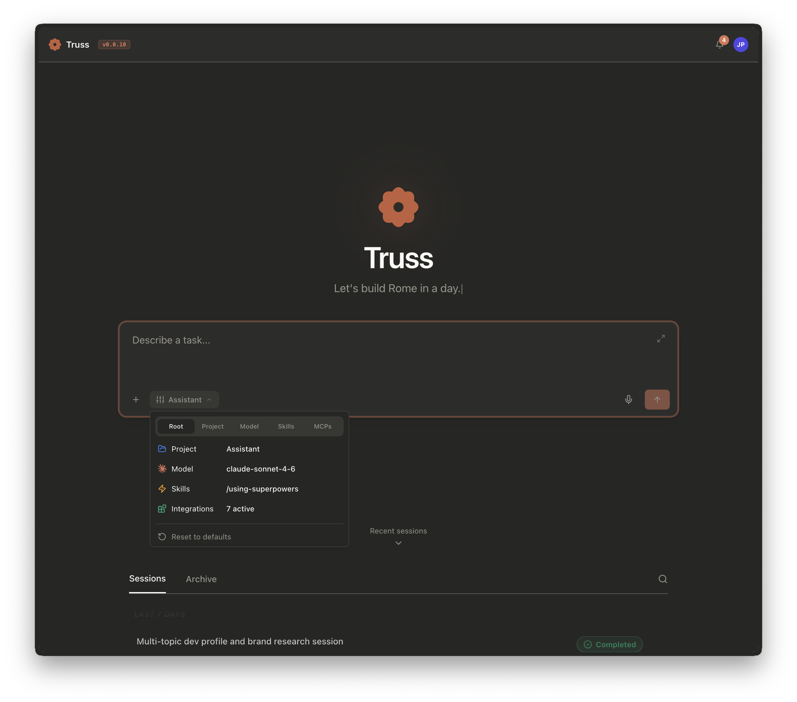

<!--
  Maintainer note: this landing page is a decision surface, not a sitemap.
  The sidebar already enumerates pages. Every section here should help a
  visitor self-select a path (surface, journey stage, capability cluster).
  Keep positioning aligned with README.md when core messaging changes.
-->

<section class="ms-hero" markdown>

bearlike / Assistant

# Truss is an AI agent that plans, delegates, and completes your work.

Hand off a goal. Truss drafts a plan and spawns parallel sub-agents for the independent
pieces. A live hypervisor watches every child for stalls, drift, and budget overruns. You get
one synthesised answer with the full audit trail. Any model works. Your existing MCP configs,
skills, plugins, and project instructions drop in unchanged.

  <a class="ms-btn ms-btn--primary" href="getting-started/">Quickstart →</a>
  <a class="ms-btn ms-btn--secondary" href="deployment-docker/">Install via Docker</a>
  <a class="ms-btn ms-btn--ghost" href="reference/">API reference</a>

  
    <svg class="ms-pill__icon" viewBox="0 0 24 24" width="14" height="14" fill="none" stroke="currentColor" stroke-width="2" stroke-linecap="round" stroke-linejoin="round" aria-hidden="true">
      <line x1="6" y1="3" x2="6" y2="15"/><circle cx="18" cy="6" r="3"/><circle cx="6" cy="18" r="3"/><path d="M18 9a9 9 0 0 1-9 9"/>
    </svg>
    Parallel sub-agents
  
  
    <svg class="ms-pill__icon" viewBox="0 0 24 24" width="14" height="14" fill="none" stroke="currentColor" stroke-width="2" stroke-linecap="round" stroke-linejoin="round" aria-hidden="true">
      <rect x="2" y="3" width="20" height="14" rx="2"/><line x1="8" y1="21" x2="16" y2="21"/><line x1="12" y1="17" x2="12" y2="21"/><path d="m10 8 4 2-4 2Z" fill="currentColor"/>
    </svg>
    Per-session Web IDE
  
  
    <svg class="ms-pill__icon" viewBox="0 0 24 24" width="14" height="14" fill="none" stroke="currentColor" stroke-width="2" stroke-linecap="round" stroke-linejoin="round" aria-hidden="true">
      <path d="m12 3-1.9 5.8L4 10.6l5.2 3.2L8.4 20l3.6-3.5 3.6 3.5-.8-6.2 5.2-3.2-6.1-1.8Z"/>
    </svg>
    Live LSP diagnostics
  
  
    <svg class="ms-pill__icon" viewBox="0 0 24 24" width="14" height="14" fill="none" stroke="currentColor" stroke-width="2" stroke-linecap="round" stroke-linejoin="round" aria-hidden="true">
      <path d="M18 6 7 17l-4-4"/><path d="m21 10-7.5 7.5L12 16"/>
    </svg>
    Claude Code and Codex compatible
  
  
    <svg class="ms-pill__icon" viewBox="0 0 24 24" width="14" height="14" fill="none" stroke="currentColor" stroke-width="2" stroke-linecap="round" stroke-linejoin="round" aria-hidden="true">
      <rect x="3" y="4" width="18" height="14" rx="2"/><line x1="3" y1="9" x2="21" y2="9"/><line x1="8" y1="13" x2="13" y2="13"/><line x1="8" y1="15" x2="11" y2="15"/>
    </svg>
    Interactive widgets inline in chat
  

  
  
  

</section>

---

## Choose your surface { .ms-h2-icon data-icon="target" }

One engine. Five clients. Pick whichever matches where the work already happens inside your team. Behaviour, tools, and configs are identical across all of them; the mode of access is what changes.

<a class="ms-card" href="clients-cli/">
  
    <svg viewBox="0 0 24 24" width="22" height="22" fill="none" stroke="currentColor" stroke-width="2" stroke-linecap="round" stroke-linejoin="round" aria-hidden="true">
      <polyline points="4 17 10 11 4 5"/><line x1="12" y1="19" x2="20" y2="19"/>
    </svg>
  
  CLI
  For developers shipping code. Run tests, refactors, and migrations alongside your git workflow, with plan-mode approval ahead of any destructive step.
</a>

<a class="ms-card" href="clients-web-api/">
  
    <svg viewBox="0 0 24 24" width="22" height="22" fill="none" stroke="currentColor" stroke-width="2" stroke-linecap="round" stroke-linejoin="round" aria-hidden="true">
      <rect x="3" y="3" width="18" height="18" rx="2"/><path d="M3 9h18"/><circle cx="7" cy="6" r="0.5" fill="currentColor"/>
    </svg>
  
  Web console &amp; API
  For teams that need audit trails. Review sessions side by side, and drive scheduled runs from CI, cron, or your internal ops stack.
</a>

<a class="ms-card" href="clients-nextcloud-talk/">
  
    <svg viewBox="0 0 24 24" width="16" height="16" fill="currentColor" aria-label="Slack"><path d="M5.042 15.165a2.53 2.53 0 0 1-2.52 2.523A2.53 2.53 0 0 1 0 15.165a2.527 2.527 0 0 1 2.522-2.52h2.52zm1.271 0a2.527 2.527 0 0 1 2.521-2.52a2.527 2.527 0 0 1 2.521 2.52v6.313A2.53 2.53 0 0 1 8.834 24a2.53 2.53 0 0 1-2.521-2.522zM8.834 5.042a2.53 2.53 0 0 1-2.521-2.52A2.53 2.53 0 0 1 8.834 0a2.53 2.53 0 0 1 2.521 2.522v2.52zm0 1.271a2.53 2.53 0 0 1 2.521 2.521a2.53 2.53 0 0 1-2.521 2.521H2.522A2.53 2.53 0 0 1 0 8.834a2.53 2.53 0 0 1 2.522-2.521zm10.122 2.521a2.53 2.53 0 0 1 2.522-2.521A2.53 2.53 0 0 1 24 8.834a2.53 2.53 0 0 1-2.522 2.521h-2.522zm-1.268 0a2.53 2.53 0 0 1-2.523 2.521a2.527 2.527 0 0 1-2.52-2.521V2.522A2.527 2.527 0 0 1 15.165 0a2.53 2.53 0 0 1 2.523 2.522zm-2.523 10.122a2.53 2.53 0 0 1 2.523 2.522A2.53 2.53 0 0 1 15.165 24a2.527 2.527 0 0 1-2.52-2.522v-2.522zm0-1.268a2.527 2.527 0 0 1-2.52-2.523a2.526 2.526 0 0 1 2.52-2.52h6.313A2.527 2.527 0 0 1 24 15.165a2.53 2.53 0 0 1-2.522 2.523z"/></svg>
    <svg viewBox="0 0 24 24" width="16" height="16" fill="currentColor" aria-label="Microsoft Teams"><path d="M20.625 8.127q-.55 0-1.025-.205t-.832-.563t-.563-.832T18 5.502q0-.54.205-1.02t.563-.837q.357-.358.832-.563q.474-.205 1.025-.205q.54 0 1.02.205t.837.563q.358.357.563.837t.205 1.02q0 .55-.205 1.025t-.563.832q-.357.358-.837.563t-1.02.205m0-3.75q-.469 0-.797.328t-.328.797t.328.797t.797.328t.797-.328t.328-.797t-.328-.797t-.797-.328M24 10.002v5.578q0 .774-.293 1.46t-.803 1.194q-.51.51-1.195.803q-.686.293-1.459.293q-.445 0-.908-.105q-.463-.106-.85-.329q-.293.95-.855 1.729t-1.319 1.336t-1.67.861t-1.898.305q-1.148 0-2.162-.398q-1.014-.399-1.805-1.102t-1.312-1.664t-.674-2.086h-5.8q-.411 0-.704-.293T0 16.881V6.873q0-.41.293-.703t.703-.293h8.59q-.34-.715-.34-1.5q0-.727.275-1.365q.276-.639.75-1.114q.475-.474 1.114-.75q.638-.275 1.365-.275t1.365.275t1.114.75q.474.475.75 1.114q.275.638.275 1.365t-.275 1.365q-.276.639-.75 1.113q-.475.475-1.114.75q-.638.276-1.365.276q-.188 0-.375-.024q-.188-.023-.375-.058v1.078h10.875q.469 0 .797.328t.328.797M12.75 2.373q-.41 0-.78.158q-.368.158-.638.434q-.27.275-.428.639q-.158.363-.158.773t.158.78q.159.368.428.638q.27.27.639.428t.779.158t.773-.158q.364-.159.64-.428q.274-.27.433-.639t.158-.779t-.158-.773q-.159-.364-.434-.64q-.275-.275-.639-.433q-.363-.158-.773-.158M6.937 9.814h2.25V7.94H2.814v1.875h2.25v6h1.875zm10.313 7.313v-6.75H12v6.504q0 .41-.293.703t-.703.293H8.309q.152.809.556 1.5q.405.691.985 1.19q.58.497 1.318.779q.738.281 1.582.281q.926 0 1.746-.352q.82-.351 1.436-.966q.615-.616.966-1.43q.352-.815.352-1.752m5.25-1.547v-5.203h-3.75v6.855q.305.305.691.452q.387.146.809.146q.469 0 .879-.176q.41-.175.715-.48q.304-.305.48-.715t.176-.879"/></svg>
    <svg viewBox="0 0 24 24" width="16" height="16" fill="currentColor" aria-label="Nextcloud Talk"><path d="M12.018 6.537c-2.5 0-4.6 1.712-5.241 4.015c-.56-1.232-1.793-2.105-3.225-2.105A3.57 3.57 0 0 0 0 12a3.57 3.57 0 0 0 3.552 3.553c1.432 0 2.664-.874 3.224-2.106c.641 2.304 2.742 4.016 5.242 4.016c2.487 0 4.576-1.693 5.231-3.977c.569 1.21 1.783 2.067 3.198 2.067A3.57 3.57 0 0 0 24 12a3.57 3.57 0 0 0-3.553-3.553c-1.416 0-2.63.858-3.199 2.067c-.654-2.284-2.743-3.978-5.23-3.977m0 2.085c1.878 0 3.378 1.5 3.378 3.378s-1.5 3.378-3.378 3.378A3.36 3.36 0 0 1 8.641 12c0-1.878 1.5-3.378 3.377-3.378m-8.466 1.91c.822 0 1.467.645 1.467 1.468s-.644 1.467-1.467 1.468A1.45 1.45 0 0 1 2.085 12a1.45 1.45 0 0 1 1.467-1.467zm16.895 0c.823 0 1.468.645 1.468 1.468s-.645 1.468-1.468 1.468A1.45 1.45 0 0 1 18.98 12a1.45 1.45 0 0 1 1.467-1.467z"/></svg>
  
  Chat platforms
  For the channels where your team already talks. Native safe adapters for Slack, Microsoft Teams, and Nextcloud Talk.
</a>

<a class="ms-card" href="clients-email/">
  
    <svg viewBox="0 0 24 24" width="22" height="22" fill="none" stroke="currentColor" stroke-width="2" stroke-linecap="round" stroke-linejoin="round" aria-hidden="true">
      <rect x="3" y="5" width="18" height="14" rx="2"/><path d="m3 7 9 6 9-6"/>
    </svg>
  
  Email
  For colleagues who work from the inbox. Execs, external clients, and field staff send a normal email and get a styled reply minutes later.
</a>

<a class="ms-card" href="clients-home-assistant/">
  
    <svg viewBox="0 0 24 24" width="22" height="22" fill="currentColor" aria-hidden="true"><path d="M22.939 10.627L13.061.749a1.505 1.505 0 0 0-2.121 0l-9.879 9.878C.478 11.21 0 12.363 0 13.187v9c0 .826.675 1.5 1.5 1.5h9.227l-4.063-4.062a2 2 0 0 1-.664.113c-1.13 0-2.05-.92-2.05-2.05s.92-2.05 2.05-2.05s2.05.92 2.05 2.05c0 .233-.041.456-.113.665l3.163 3.163V9.928a2.05 2.05 0 0 1-1.15-1.84c0-1.13.92-2.05 2.05-2.05s2.05.92 2.05 2.05a2.05 2.05 0 0 1-1.15 1.84v8.127l3.146-3.146A2.05 2.05 0 0 1 18 12.239c1.13 0 2.05.92 2.05 2.05s-.92 2.05-2.05 2.05a2 2 0 0 1-.709-.13L12.9 20.602v3.088h9.6c.825 0 1.5-.675 1.5-1.5v-9c0-.825-.477-1.977-1.061-2.561z"/></svg>
  
  Home Assistant
  For facilities running HA OS, operators can drive meeting room setup, occupancy checks, and deployment checks across every exposed sensor by text or voice.
</a>

---

## How it works { .ms-h2-icon data-icon="flow" }

### You describe an outcome

Ask for it in plain English on whichever surface is closest. In plan mode, the root agent drafts the steps first and waits for your approval. Destructive work never runs before you sign off on the plan.

### Truss delegates in parallel

The root agent spawns sub-agents for any pieces of work that can run at the same time. A test run, a search, a refactor, and an MCP call against an external service can all execute in parallel. A live hypervisor watches every child for stalls. It steers drifting agents back with natural-language nudges between tool steps, and enforces per-agent token budgets without killing in-flight context. The tree grows in real time and you can steer or cancel any branch.

### You get a synthesised answer, not a pile of logs

Each sub-agent returns a structured result: status, summary, warnings, files touched, and acceptance-criteria checks. The root synthesises them into one coherent answer, alongside a full transcript of every tool call, every permission prompt, and every compaction. Fork any message to branch the conversation, replay a failure against a different model, or hand the whole thing off to a teammate.

!!! note "Go deeper"

    Want the internals? See [Architecture Overview](core-orchestration.md) for the tool-use loop, hypervisor, and structured-concurrency lifecycle.

---

## What's new { .ms-h2-icon data-icon="star" }

<a class="ms-card" href="features-widgets/">
Widgets inline in chat
Ask for a chart, a card, or a data table and an interactive widget appears directly in the conversation. Widgets run in a sandboxed browser environment with no server involvement. Data is baked in at creation time, so widgets persist across sessions as permanent snapshots. Teams with internal data systems that lack good reporting interfaces can surface results visually on demand.
</a>

<a class="ms-card" href="features-plugins/">
Plugin and Agent Skills platform
Extend Truss with new agent types, skills, hooks, and tools using the same plugin format as Claude Code. Plugins are compatible with the official Claude plugins marketplace and activate automatically at session start. Capability gating ensures features only appear on surfaces that can support them. The bundled widget-builder is the reference example.
</a>

---

## Already using Claude Code or Codex? { .ms-h2-icon data-icon="plug" }

Truss reads the configuration you already have. Point it at a project and it picks up your MCP servers, skills, plugins, and instruction hierarchy automatically. No rewrites, no new formats.

MCP servers
Both the Truss <code>servers</code> and the Claude Code / VS Code <code>mcpServers</code> schemas are accepted at project and user scope.

Skills
<code>SKILL.md</code> files in <code>~/.claude/skills/</code> or <code>.claude/skills/</code> activate exactly as authored, with the Agent Skills standard.

Plugins &amp; marketplaces
Claude Code plugin manifests install without translation. Point Truss at any Claude Code-compatible marketplace and it just works.

Project instructions
<code>CLAUDE.md</code>, <code>AGENTS.md</code>, and <code>.claude/rules/*.md</code> all load hierarchically on session start.

<a class="ms-card" href="features-plugins/#session-tools">
Session tools
Plugins contribute per-agent stateful tools via a <code>session_tools</code> array in <code>plugin.json</code>. The core imports the class and wires it to the <code>ToolUseLoop</code>; widgets, exit-plan-mode, and future capability bundles all use the same primitive.
</a>

!!! note "See also"

    [Project Setup](project-configuration.md) and [Plugins &amp; Marketplace](features-plugins.md) walk through the complete compatibility matrix.

---

## What you can do { .ms-h2-icon data-icon="grid" }

Workspace &amp; execution
<ul class="ms-card__list">
  <li><a href="features-builtin-tools/">Built-in tools</a>: read, edit, shell, list</li>
  <li><a href="features-web-ide/">Web IDE</a>: per-session code-server</li>
  <li><a href="features-lsp/">Code intelligence (LSP)</a></li>
  <li><a href="features-mcp/">External tools (MCP)</a></li>
  <li><a href="features-widgets/">Widgets</a>: interactive UI inline in chat</li>
</ul>

Composition &amp; delegation
<ul class="ms-card__list">
  <li><a href="features-agents/">Sub-agents and the hypervisor</a></li>
  <li><a href="features-skills/">Skills (Agent Skills standard)</a></li>
  <li><a href="features-plugins/">Plugins and marketplace</a></li>
</ul>

Control &amp; safety
<ul class="ms-card__list">
  <li><a href="features-plan-mode/">Plan mode</a>: review before execution</li>
  <li><a href="features-permissions-hooks/">Permissions and hooks</a></li>
  <li><a href="troubleshooting/">Troubleshooting guide</a></li>
</ul>

Session &amp; context
<ul class="ms-card__list">
  <li><a href="features-token-usage/">Token usage and budgets</a></li>
  <li><a href="features-compaction/">Compaction (FULL / PARTIAL)</a></li>
  <li><a href="session-runtime/">Session runtime</a></li>
</ul>

---

## From install to production { .ms-h2-icon data-icon="route" }

A five-step journey. Each step is short, and each link lands on the page you need.

Install

<ul class="ms-step__links">
  <li><a href="getting-started/">Get Started</a></li>
  <li><a href="deployment-docker/">Docker Compose</a></li>
</ul>

Configure

<ul class="ms-step__links">
  <li><a href="llm-setup/">LLM setup</a></li>
  <li><a href="configuration/">Configuration reference</a></li>
  <li><a href="project-configuration/">Project setup</a></li>
</ul>

Use

<ul class="ms-step__links">
  <li><a href="clients-cli/">CLI</a></li>
  <li><a href="clients-web-api/">Web console and API</a></li>
  <li><a href="features-plan-mode/">Plan mode</a></li>
</ul>

Deploy

<ul class="ms-step__links">
  <li><a href="deployment-production/">Production setup</a></li>
  <li><a href="deployment-storage/">Storage backends</a></li>
  <li><a href="features-permissions-hooks/">Permissions and hooks</a></li>
</ul>

Extend

<ul class="ms-step__links">
  <li><a href="features-mcp/">MCP tools</a></li>
  <li><a href="features-plugins/">Plugins</a></li>
  <li><a href="features-widgets/">Interactive widgets</a></li>
  <li><a href="developer-guide/">Build a client</a></li>
</ul>

---

## Keep learning { .ms-h2-icon data-icon="book" }

<a class="ms-card" href="https://github.com/bearlike/Assistant">
  
    <svg viewBox="0 0 24 24" width="22" height="22" fill="none" stroke="currentColor" stroke-width="2" stroke-linecap="round" stroke-linejoin="round" aria-hidden="true">
      <path d="M9 19c-5 1.5-5-2.5-7-3m14 6v-3.87a3.37 3.37 0 0 0-.94-2.61c3.14-.35 6.44-1.54 6.44-7A5.44 5.44 0 0 0 20 4.77 5.07 5.07 0 0 0 19.91 1S18.73.65 16 2.48a13.38 13.38 0 0 0-7 0C6.27.65 5.09 1 5.09 1A5.07 5.07 0 0 0 5 4.77a5.44 5.44 0 0 0-1.5 3.78c0 5.42 3.3 6.61 6.44 7A3.37 3.37 0 0 0 9 18.13V22"/>
    </svg>
  
  GitHub repo
  Source, issues, and releases.
</a>

<a class="ms-card" href="core-orchestration/">
  
    <svg viewBox="0 0 24 24" width="22" height="22" fill="none" stroke="currentColor" stroke-width="2" stroke-linecap="round" stroke-linejoin="round" aria-hidden="true">
      <polygon points="12 2 22 8.5 12 15 2 8.5 12 2"/><polyline points="2 15.5 12 22 22 15.5"/><polyline points="2 11.5 12 18 22 11.5"/>
    </svg>
  
  Architecture deep-dive
  Tool-use loop, hypervisor, and lifecycle.
</a>

<a class="ms-card" href="troubleshooting/">
  
    <svg viewBox="0 0 24 24" width="22" height="22" fill="none" stroke="currentColor" stroke-width="2" stroke-linecap="round" stroke-linejoin="round" aria-hidden="true">
      <circle cx="12" cy="12" r="10"/><path d="M4.93 4.93 12 12l7.07 7.07"/><path d="M12 2v4"/><path d="M12 22v-4"/>
    </svg>
  
  Troubleshooting
  Common errors and how to diagnose them.
</a>

<a class="ms-card" href="https://github.com/bearlike/Assistant/releases">
  
    <svg viewBox="0 0 24 24" width="22" height="22" fill="none" stroke="currentColor" stroke-width="2" stroke-linecap="round" stroke-linejoin="round" aria-hidden="true">
      <path d="M8 6h9"/><path d="M8 12h9"/><path d="M8 18h6"/><path d="M3 6h.01"/><path d="M3 12h.01"/><path d="M3 18h.01"/>
    </svg>
  
  Changelog
  Release notes and upgrade guides.
</a>

