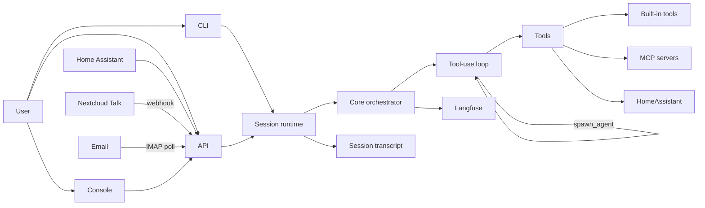

# bearlike/Assistant Docs

  
  

bearlike/Assistant (Meeseeks) is an AI task agent assistant that breaks a request into small actions, runs the right tools, and replies with a clean summary. This landing page mirrors the README feature highlights so the overview stays consistent. Update both when core positioning changes.

## Documentation map

**Start here**

- [Get Started](getting-started.md) — installation paths and first run
- [README](https://github.com/bearlike/Assistant/blob/main/README.md) — product overview and feature highlights

**Configure**

- [LLM Setup](llm-setup.md) — provider keys, model selection, fallback
- [Project Setup](project-configuration.md) — `CLAUDE.md` loading and per-project `.mcp.json`
- [Configuration Reference](configuration.md) — every key in `configs/app.json`

**Use**

- [CLI](clients-cli.md) — terminal interface
- [Web Console + API](clients-web-api.md) — web console and REST API
- [Home Assistant](clients-home-assistant.md) — smart-home voice integration
- [Nextcloud Talk](clients-nextcloud-talk.md) — chat integration via webhook
- [Email](clients-email.md) — email channel via IMAP/SMTP

**Capabilities**

*Workspace & Execution*

- [Built-in Tools](features-builtin-tools.md) — read, edit, shell, and list
- [Web IDE](features-web-ide.md) — per-session code-server in the browser
- [Code Intelligence (LSP)](features-lsp.md) — diagnostics, definitions, references
- [External Tools (MCP)](features-mcp.md) — connect external tool servers

*Composition & Delegation*

- [Sub-agents](features-agents.md) — parallel delegation to child agents
- [Skills](features-skills.md) — reusable instruction sets
- [Plugins & Marketplace](features-plugins.md) — installable extensions

*Control & Safety*

- [Plan Mode](features-plan-mode.md) — propose before acting, with approval
- [Permissions & Hooks](features-permissions-hooks.md) — tool gates and lifecycle events

*Session & Context*

- [Token Usage](features-token-usage.md) — usage tracking and prompt caching
- [Compaction](features-compaction.md) — automatic context-window management

**Deploy**

- [Docker Compose](deployment-docker.md) — container stack and env vars
- [Storage Backends](deployment-storage.md) — JSON vs MongoDB
- [Production Setup](deployment-production.md) — TLS, Langfuse, token rotation

**Develop**

- [Architecture Overview](core-orchestration.md) — internals, data flow, and subsystem reference
- [Session Runtime](session-runtime.md) — shared runtime used by CLI + API
- [Building a Client](developer-guide.md) — core abstractions and integration walkthrough
- [API Reference](reference.md) — mkdocstrings reference for core modules

**Help**

- [Troubleshooting](troubleshooting.md) — common errors and fixes

## What you can do with Meeseeks

- Hand it a task in natural language and watch it work through the steps in your terminal, browser, or inbox.
- Delegate independent sub-tasks to parallel sub-agents so long-running work finishes in less wall-clock time.
- Reach the assistant from the surface that suits the moment: a web console, a CLI, a Home Assistant voice flow, a Nextcloud Talk room, or an email thread.
- Edit code, read files, and run shell commands directly from the chat — with approval gates you control.
- Plug in external tools via the Model Context Protocol (MCP) and wrap your own workflows as reusable skills or installable plugins.
- Open a full-featured browser IDE (code-server) alongside the assistant for any session, with a per-session container.
- See real code diagnostics, go-to-definition, and hover types inline as the assistant edits (powered by the Language Server Protocol).
- Run long sessions past the model's context limit — compaction summarises older turns automatically.
- Track token usage, prompt-cache savings, and cost separately for root and sub-agents.

## Already using Claude Code, Codex, or other agent tools?

Meeseeks is deliberately cross-compatible with the ecosystem you already know. Your existing configs drop in unchanged:

- **MCP servers** — [`mcp.json`](features-mcp.md) accepts both the Meeseeks `servers` key and the Claude Code / VS Code `mcpServers` key. Based on the open [Model Context Protocol](https://modelcontextprotocol.io).
- **Skills** — `SKILL.md` files in `~/.claude/skills/` or `.claude/skills/` follow the [Agent Skills](https://docs.claude.com/en/api/agent-skills) standard. Anything you wrote for Claude Code works here.
- **Plugins & marketplaces** — Uses the [Claude Code plugin](https://docs.claude.com/en/docs/claude-code/plugins) manifest and marketplace schema. The default marketplace is [`anthropics/claude-plugins-official`](https://github.com/anthropics/claude-plugins-official). Private marketplaces that follow the same schema load without translation.
- **Project instructions** — Reads both [`CLAUDE.md`](https://docs.claude.com/en/docs/claude-code/memory) and the open [`AGENTS.md`](https://agents.md) convention.

## How requests flow

A user query arrives from one of the supported surfaces, gets routed through the session runtime, and is handled by the core orchestrator. The orchestrator drives a single tool-use loop — the model decides which tools to call, tools run (including spawning sub-agents when useful), and results flow back into the conversation until the model produces a final answer.

Developers who want the full internals — the single async execution engine, the hypervisor that governs the agent tree, compaction, plugins, and channel adapters — should read [Architecture Overview](core-orchestration.md).

## Getting started
See [Installation](getting-started.md) for setup, and [CLI](clients-cli.md) for command reference.

## Deployment (Docker)
See [getting-started.md](getting-started.md) for Docker setup and environment requirements.
