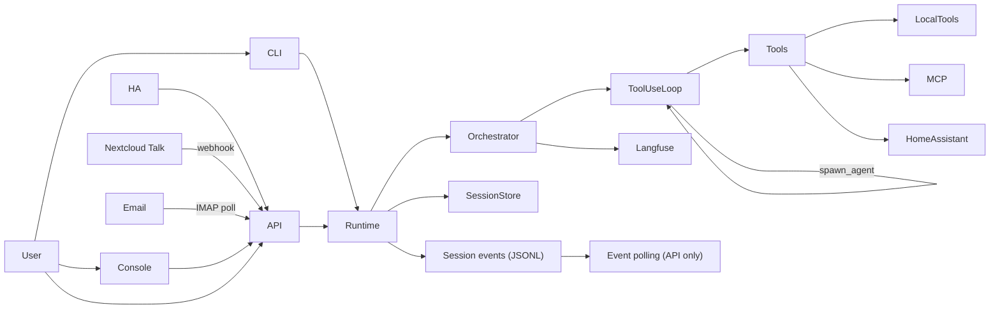

# bearlike/Assistant Docs

  
  

bearlike/Assistant (Meeseeks) is an AI task agent assistant that breaks a request into small actions, runs the right tools, and replies with a clean summary. This landing page mirrors the README feature highlights so the overview stays consistent. Update both when core positioning changes.

## Documentation map

**Overview**
- [README](https://github.com/bearlike/Assistant/blob/main/README.md) - high-level product overview and feature highlights
- [Core orchestration](core-orchestration.md) - execution flow and core features

**Setup and configuration**
- [Installation](getting-started.md) - environment setup and install paths
- [LLM setup](llm-setup.md) - minimum LLM config and LiteLLM notes

**Clients**
- [CLI](clients-cli.md) - terminal interface
- [Console + API](clients-web-api.md) - Web console and REST API
- [Home Assistant voice](clients-home-assistant.md) - HA Assist integration
- [Nextcloud Talk](clients-nextcloud-talk.md) - chat platform integration via webhook
- [Email](clients-email.md) - email channel via IMAP/SMTP

**Developer**
- [Developer guide](developer-guide.md) - core abstractions and new client walkthrough

**Reference**
- [API reference](reference.md) - mkdocstrings reference for core modules
- [Session runtime](session-runtime.md) - shared runtime used by CLI + API

## Feature highlights (quick view)
- Unified async tool-use loop where the LLM drives tool selection via native `bind_tools`.
- Sub-agent spawning for parallel subtasks, managed by the AgentHypervisor control plane.
- Multiple interfaces (web console, REST API, Home Assistant, Nextcloud Talk, terminal CLI) backed by one core engine.
- Tool registry for local tools plus optional MCP tools.
- Built-in local file and shell tools — native `read_file` with line-windowing and dedup cache, plus edit, list, and shell execution.
- Configurable file editing with auto-selection based on model identity (Aider SEARCH/REPLACE or structured patch).
- Session transcripts with auto-compact for long runs and token budget awareness.
- Conversation fork-from-message, edit and regenerate, per-message model override.
- Context snapshots built from recent turns plus summaries of prior activity.
- Session listings filter empty sessions and support archiving via the API.
- Permission gate with approval callbacks plus bidirectional hooks (command + HTTP) around tool execution and session lifecycle.
- Plugin system for discovering, installing, and managing extensions (agent definitions, skills, hooks, MCP tools) from configured marketplaces.
- Native LSP code intelligence via `lsp_tool` (pygls-backed): diagnostics, go-to-definition, find-references, hover. Built-in servers for Python (pyright), TypeScript/JS (typescript-language-server), Go (gopls), Rust (rust-analyzer) — auto-discovered on PATH. Passive diagnostics inject after file edits.
- Opt-in per-session Web IDE (code-server containers) accessible from the console.
- Chat platform adapter framework (`ChannelAdapter` protocol) with shared `_process_inbound()` pipeline. Supports webhook-driven (Nextcloud Talk) and poll-driven (Email via IMAP) channels. Slack/Discord follow the same pattern.
- Shared session runtime; API exposes polling endpoints while the CLI runs the runtime in-process for sync execution, cancellation, and summaries.
- External MCP servers can be added via `configs/mcp.json` with schema-aware tool inputs.
- Model routing with provider-qualified names and `proxy_model_prefix` for proxy routing.
- Optional components (Langfuse, Home Assistant) auto-disable when not configured.
- Langfuse tracing is session-scoped when enabled, grouping multi-turn runs.

## Repo map (short)
- `packages/meeseeks_core/`: orchestration loop, schemas, session storage, compaction, tool registry, plugin system, agent registry.
- `packages/meeseeks_tools/`: tool implementations and integrations.
- `apps/meeseeks_api/`: Flask API that exposes the assistant over HTTP, plugin management, Web IDE lifecycle.
- `apps/meeseeks_console/`: Web console for task orchestration, plugin management, and Web IDE access.
- `apps/meeseeks_cli/`: terminal CLI for interactive sessions.
- `meeseeks_ha_conversation/`: Home Assistant integration that routes voice requests to the API.

Prompts are packaged under `packages/meeseeks_core/src/meeseeks_core/prompts/`.

## Architecture in a glance
- The UI or API sends a user request into the core orchestrator.
- The orchestrator runs a single async `ToolUseLoop` — the LLM decides which tools to call.
- The LLM can spawn sub-agents for parallel work, managed by the `AgentHypervisor`.
- Tool results and summaries are stored in a session transcript for continuity.

## Getting started
See [Installation](getting-started.md) for setup, and [CLI](clients-cli.md) for command reference.

## Deployment (Docker)
See [getting-started.md](getting-started.md) for Docker setup and environment requirements.
