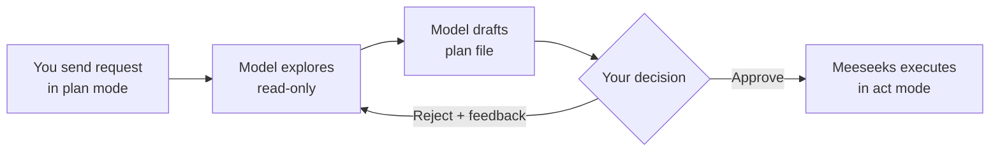

# Plan Mode

<div style="display: flex; justify-content: center;">
  
</div>

By default Meeseeks runs in **act mode**: the model calls tools as soon as it decides to, and each call executes immediately. That is usually what you want for quick, low-risk work. For anything destructive, complex, or unfamiliar, switch to **plan mode**. In plan mode the assistant explores your workspace with read-only tools, drafts a step-by-step plan to a session-scoped file you can inspect, and then pauses for your approval before a single write or shell command runs. It gives you a checkpoint between "I want this done" and "the agent is changing my files."

**Quick example — switch the CLI to plan mode:**

```
/mode plan
```

Then send your request. Meeseeks drafts the plan and waits for you to type `/approve` (or click the Approve button in the console) before it starts executing.

---

## Switching modes

You can change mode from the CLI, the web console, or the REST API. The mode is per-session state and resets to `act` when you start a new session.

### CLI

```
/mode act      # default — tools run immediately
/mode plan     # explore then wait for approval
```

Running `/mode` on its own prints the current mode.

### Console

The **ConfigMenu** (the gear icon in the input bar) has an **Act / Plan** toggle. Flipping it changes the mode for the next query in the current session.

### REST API

Pass `mode` in the query body:

```json
POST /api/sessions/{session_id}/query
{
  "query": "Refactor the auth module",
  "mode": "plan"
}
```

---

## How the approval flow looks

From your point of view a plan-mode turn has three phases:

1. **Exploration.** The model reads files, lists directories, and runs read-only shell commands to build up an understanding of the task. Write tools are blocked during this phase, so nothing on disk changes.
2. **Proposal.** The model drafts the plan to a session-scoped scratch file (you can open it from the console or read it from the session directory) and then signals that it is ready for review. The CLI and the console show you the plan and wait.
3. **Decision.** You either approve the plan — in which case Meeseeks switches to act mode and carries it out — or you reject it. When rejecting you can add free-text feedback; the model receives it as context and produces a revised plan.



Approval is **episodic**: your approve/reject decision is recorded in the session transcript and persists across restarts. If you quit the process between the plan draft and the execution step, the session resumes cleanly the next time you pick it up. Revisions are tracked too, so when you reject with feedback and the model comes back with a second draft, you can tell it apart from the first.

---

## Shell commands during exploration

Plan mode enforces a **shell allowlist** so the exploration phase stays read-only. Only commands whose first word matches a configured prefix are allowed, and anything with dangerous operators like `|`, `>`, `$`, or command substitution is rejected outright regardless of the allowlist. This is a belt-and-braces check: even if a permitted command could be chained into something destructive, the operator filter blocks the chain.

The default allowlist covers the usual read-only tools — `ls`, `cat`, `grep`, `rg`, `find`, `git status`, `git log`, `git diff`, `git show`, and similar. Prefix matches are word-boundary safe: `"git log"` matches `"git log --oneline"` but not `"git logger"`. Customise the list via `agent.plan_mode_shell_allowlist`, or set it to `[]` to block shell access in plan mode entirely.

MCP tools are permitted during exploration by default; toggle `agent.plan_mode_allow_mcp` if you want to block them too.

---

## Recovery: /retry and /continue

Both commands recover from a failed or stalled session without starting fresh. They are available in the CLI and as per-message buttons in the web console.

### /retry

`/retry` replays the last user turn from a clean slate. Meeseeks removes the failed exchange from the transcript and re-submits your original query. The model does not see the failure.

```
/retry
```

Use `/retry` when the model made the wrong tool calls or hit a transient error and a clean re-run is likely to succeed.

### /continue

`/continue` keeps the failed state in the transcript and appends a "continue from where you left off" prompt. The model sees what already happened and picks up without repeating completed work.

```
/continue
```

Use `/continue` when partial work succeeded and only the tail failed — a retry from scratch would redo work already done.

---

## Configuration

| Key | Default | Description |
|-----|---------|-------------|
| `agent.plan_mode_shell_allowlist` | (read-only commands) | Command prefixes allowed during plan-mode exploration. Matched at a word boundary; prefix entries like `"git log"` match `"git log --oneline"` but not `"git logger"`. Set to `[]` to block shell entirely. |
| `agent.plan_mode_allow_mcp` | `true` | Allow user-enabled MCP tools during plan mode. Set to `false` to block MCP tools in plan mode. |
| `agent.edit_tool` | `""` | Override the file editing tool: `"search_replace_block"` or `"structured_patch"`. Empty auto-selects based on the active model. |

See [configuration.md](configuration.md) for the full `agent` config section.

> **How it works internally:** See [Architecture Overview → Plan mode signals](core-orchestration.md#plan-mode).
